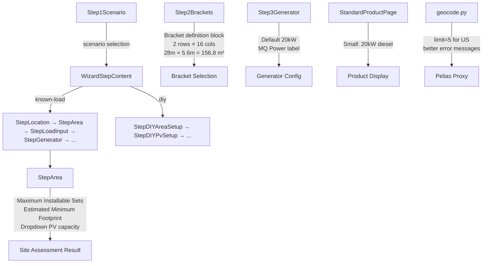

# Design Document: Platform Refinement

## Overview

This design addresses a comprehensive set of UX, data accuracy, and documentation issues identified by the US team during real-world usage of the VoltageEnergy MicroGrid Configuration System. The changes span frontend UI components, backend geocoding logic, product data corrections, and project documentation structure. The goal is to evolve the platform from a demo state toward production-ready quality.

## Architecture

The existing architecture remains unchanged: React+Vite frontend → FastAPI backend → Pelias geocoder. All changes are within existing layers:

- **Frontend components**: StepArea, Step2Brackets, Step3Generator, Step1Scenario, StepLocation, StandardProductPage, StepOptimize
- **Backend geocode router**: Enhanced error handling and limit parameter
- **Static data**: products.yaml diesel_ratio correction, StandardProductPage topology data
- **Documentation**: New structured docs/ and cases/ directories



## Components and Interfaces

### 1. Step1Scenario (frontend)
- Add bilingual descriptions explaining Known-Load vs DIY vs Standard Product
- Use `useLang()` hook for language-aware rendering
- No interface changes; only content updates

### 2. StepArea (frontend) — Revised
- Rename input label "Enter usable area" → "Enter site area" (输入场地面积)
- Map polygon measurement writes back to the same "Site Area" input field
- Remove "Measured Area" card from assessment results (redundant with input)
- Remove "Estimated Minimum Footprint" card (confusing concept)
- Keep only two derived metrics: "Usable Area" (backend-computed, spacing-deducted) and "Maximum Installable Sets"
- Call backend `/api/layout/optimize` with `availableAreaM2` to get `maxSystems` and derive usable area
- Usable Area = maxSystems × bracket body area (156.8 m² for standard_32)
- Show ft² as primary unit, m² as secondary (e.g., "11,840 ft² (1,100 m²)")
- Show precise area values (1,687.8 ft² / 156.8 m²)

### 3. Step2Brackets (frontend)
- Add bracket definition explanation block before the set selector
- Show: panel count, row×column arrangement, physical dimensions, footprint area
- Update dynamically when bracket model changes

### 4. Step3Generator (frontend)
- Change default existing generator capacity from 40 kW to 20 kW
- Add "(MQ Power)" label to the 20 kW preset button
- Add comment referencing MQ Power DCA20SPXU4F

### 5. StandardProductPage (frontend)
- Change Small PV-Storage-Diesel diesel capacity from 40 kW to 20 kW in SIZE_TOPOLOGY_DATA

### 6. StepLocation (frontend)
- Improve solar parameter error messages with specific failure reasons
- Ensure retry logic triggers when apiAvailable transitions to true

### 7. Backend geocode.py
- Increase default `limit` from 1 to 5 for US queries to improve street-level address matching
- Improve error message specificity for Pelias unavailability vs network issues

### 8. StepOptimize (frontend)
- Replace hardcoded Chinese text in DesignLogic and ConstraintPanel with bilingual text using lang context

### 9. Documentation structure
- Create numbered docs files (00-14)
- Create cases directory with scenario files

## Data Models

### products.yaml schema additions

The following new fields will be added to `products.yaml`:

```yaml
bracket_systems:
  spacing_m: 3.048          # NEW: adjacent bracket minimum spacing (10 ft)
  default_model: "standard_32"
  models:
    "standard_32":
      display_name: "标准折叠支架 32块/套"
      panels_per_set: 32
      area_m2: 156.8
      footprint_length_m: 28.0   # NEW: physical length
      footprint_width_m: 5.6     # NEW: physical width
      # ... other models similarly

site_layout:                     # NEW section
  tray_length_m: 6.2
  tray_width_m: 4.4
  diesel_reserved_area_m2: 75.0
  inverters_per_tray: 2

accessories:
  pv_mounting_cost_per_set_usd: 19050   # NEW: was hardcoded as 76200/4
  # ... existing fields unchanged

simulation_defaults:             # NEW section
  system_efficiency: 0.78        # PV system efficiency (inverter + line + temp loss)
```

The existing `ConfigData`, `OptimizeOption`, `CalculateResponse` TypeScript types remain unchanged. The frontend products store will be extended to expose the new fields.

### Parameter flow

```
products.yaml (single source of truth)
  → backend config_loader.py (parses all fields)
    → layout_optimizer.py (spacing, dimensions)
    → site_rules.py (tray, diesel area, inverters/tray)
    → calculator.py (mounting cost, pallet cost)
    → optimizer.py (all of the above + system_efficiency)
  → /api/products endpoint (serves to frontend)
    → useProductsStore (parses and caches)
      → SiteAreaMap.tsx (spacing, dimensions for local layout)
      → StepArea.tsx (spacing, dimensions for display)
      → StepOptimize.tsx (area per set with spacing)
      → Step2Brackets.tsx (dimensions for explanation text)
      → StepDIYPvSetup.tsx (dimensions for error text)
      → i18n dynamic text (no more hardcoded numbers in translations)
```

## Correctness Properties

*A property is a characteristic or behavior that should hold true across all valid executions of a system—essentially, a formal statement about what the system should do. Properties serve as the bridge between human-readable specifications and machine-verifiable correctness guarantees.*

### Property 1: Country code detection consistency
*For any* input string containing no Chinese characters (Unicode range \u4e00-\u9fff), the `detectCountryCodeForQuery` function SHALL return `'us'`.
**Validates: Requirements 1.3**

### Property 2: Bracket area precision
*For any* bracket model in the product catalog, the displayed area SHALL equal `panels_per_set × (STANDARD_BRACKET_AREA_M2 / 32)` with at most 0.1 m² deviation.
**Validates: Requirements 2.3**

### Property 3: Usable area derivation from backend layout
*For any* positive site area input and the standard bracket dimensions, the displayed "Usable Area" SHALL equal `maxSystems × bracket_body_area` where `maxSystems` is returned by the backend layout optimizer.
**Validates: Requirements 3.4**

### Property 4: PV capacity calculation consistency
*For any* valid combination of set count (1..maxSets), panel model, and bracket model, the PV capacity displayed in the dropdown SHALL equal `sets × panels_per_set × panel_watts / 1000` rounded to 2 decimal places.
**Validates: Requirements 4.2**

### Property 5: Locale-appropriate number formatting
*For any* numeric value and locale ('en' or 'zh'), the formatted output SHALL contain the correct unit suffix and use locale-appropriate digit grouping.
**Validates: Requirements 8.4**

## Error Handling

### Geocoding Errors
- **Pelias not running**: Display "Pelias geocoder is not running. Start the Pelias API service and verify its data import first." with suggestion to use map click or current location.
- **Network unreachable**: Display "Address search is unavailable because this machine cannot reach the geocoder." with same alternatives.
- **No results found**: Display "No matching location was found. Try a nearby city name, ZIP code, or select the site directly on the map."

### Solar Parameter Errors
- **Backend unavailable**: Display "Solar parameters could not be loaded because the backend API is unavailable." with offline mode indicator.
- **Data retrieval failure**: Display "Solar parameters could not be loaded. Retry by keeping this page open, reselecting the site, or refreshing the page."
- **Auto-retry**: When `apiAvailable` transitions from `false` to `true`, automatically retry solar parameter fetch for current coordinates.

## Testing Strategy

### Unit Tests
- Test `detectCountryCodeForQuery` with ASCII strings, Chinese strings, mixed strings
- Test footprint calculation function with known inputs
- Test PV capacity calculation with known panel/bracket combinations
- Test StandardProductPage topology data values

### Property-Based Tests
- Use `fast-check` as the property-based testing library
- Each property test SHALL run a minimum of 100 iterations
- Each property test SHALL be tagged with a comment referencing the correctness property: `**Feature: platform-refinement, Property {number}: {property_text}**`

Property tests to implement:
1. Country code detection: generate random ASCII strings → always returns 'us'
2. Bracket area precision: for all bracket models → area matches formula
3. Footprint calculation: generate random set counts (1-100) → footprint matches formula
4. PV capacity: generate random valid (sets, panelModel, bracketModel) tuples → capacity matches formula
5. Number formatting: generate random numbers and locales → output contains expected unit
