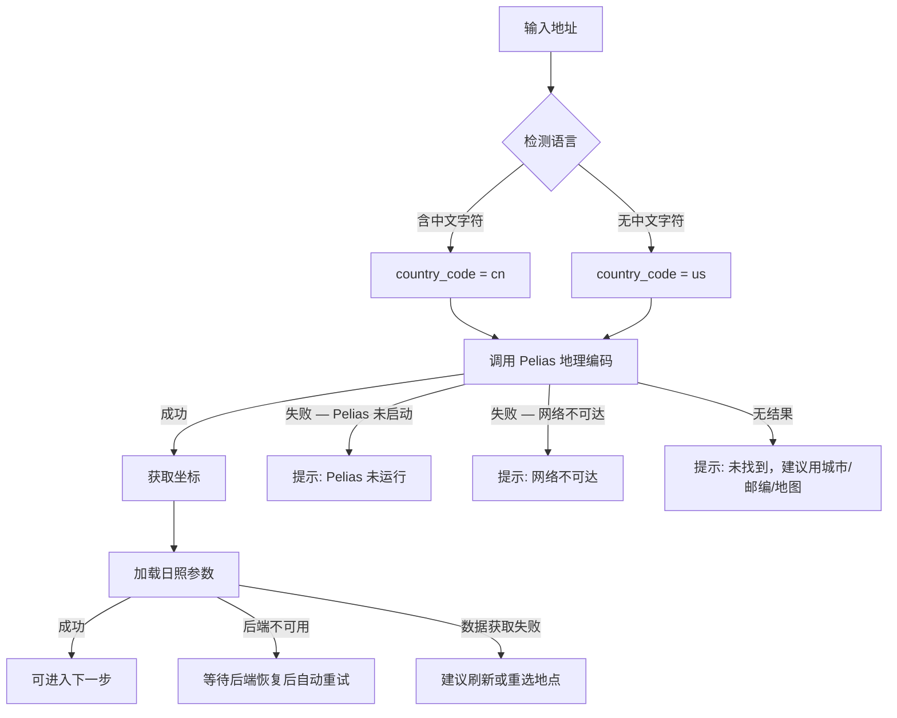

# 用户旅程图

> 本文档描述 VoltageEnergy 微电网配置系统的完整用户旅程。  
> 每次涉及流程变更的代码修改后，应同步更新本文档。  
> 最后更新：2026-04-17

---

## 总览

```mermaid
flowchart TD
    WELCOME[欢迎页] -->|点击"开始配置"| MAIN[主界面 — 侧边栏导航]
    MAIN --> STD[标准产品浏览]
    MAIN --> KL[已知负载定制]
    MAIN --> DIY[DIY 定制]

    STD --> STD_S[小型光储柴一体]
    STD --> STD_M[中型光储柴一体]
    STD --> STD_L[大型光储柴一体]

    KL --> KL_FLOW[已知负载 7 步向导]
    DIY --> DIY_FLOW[DIY 7 步向导]

    KL_FLOW --> PLAN[方案选择页]
    DIY_FLOW --> PLAN
    PLAN --> RESULT[结果页]
```

---

## 旅程 A：标准产品浏览

用户无需输入任何数据，直接查看预定义的光储柴一体化产品规格。

| 步骤 | 页面 | 用户操作 | 系统响应 |
|------|------|----------|----------|
| A1 | 欢迎页 | 点击"开始配置" | 进入主界面 |
| A2 | 侧边栏 | 选择"标准化产品" → 小型/中型/大型 | 展示对应产品拓扑图和参数 |

### 标准产品参数（当前值）

| 规格 | PV 容量 | 储能容量 | 柴发容量 | 年负荷 |
|------|---------|----------|----------|--------|
| 小型 | 83.8 kW (4 套) | 256 kWh | **20 kW** | 131,400 kWh |
| 中型 | 167.7 kW (8 套) | 512 kWh | 80 kW | 262,800 kWh |
| 大型 | 335.4 kW (16 套) | 1,024 kWh | 150 kW | 525,600 kWh |

> 小型柴发容量已从 40 kW 修正为 20 kW，对应 MQ Power DCA20SPXU4F 实际库存。

---

## 旅程 B：已知负载定制（Known-Load）

用户已知年用电量，系统自动优化 PV/储能/柴发容量。


| 步骤 | StepType | 页面标题 | 用户操作 | 关键数据 | 前置条件 |
|------|----------|----------|----------|----------|----------|
| B0 | — | 场景选择 | 选择"已知负载解决方案" | scenario = known-load | — |
| B1 | `location` | 场地信息 | 搜索地址 / 使用当前位置 / 地图选点；输入可用面积或地图框选 | latitude, longitude, availableAreaM2, peakSunHoursPerDay | 坐标 + 面积 + 日照参数均有值 |
| B2 | `area` | PV 组件 | 选择支架套数（下拉选择器） | bracketSets, pvCapacityKw | bracketSets > 0 |
| B3 | `load-input` | 负荷输入 | 输入年用电量 kWh | annualLoadKwh | annualLoadKwh > 0 |
| B4 | `generator` | 柴油发电机 | 选择已有/新购/不配置；已有时填写容量（默认 **20 kW**） | hasGenerator, dieselCapacityKw, dieselIsNew | 无阻塞 |
| B5 | `voltage` | 输出电压 | 选择电压等级 | voltageLevel | voltageLevel 已选 |
| B6 | `ems` | EMS 策略 | 配置能量管理策略 | — | 无阻塞 |
| B7 | `economic` | 经济参数 | 设置项目周期、贴现率等 | — | 无阻塞 |
| B8 | — | 方案选择 | 查看多个优化方案，选择一个 | selectedPlan | 计算完成 |
| B9 | — | 结果页 | 查看详细经济分析结果 | — | — |

### B1 选址子流程



---

## 旅程 C：DIY 定制

用户直接指定设备参数，经济分析精度 ±20–30%。


| 步骤 | StepType | 页面标题 | 用户操作 | 关键数据 | 前置条件 |
|------|----------|----------|----------|----------|----------|
| C0 | — | 场景选择 | 选择"DIY 解决方案" | scenario = diy | — |
| C1 | `diy-area-setup` | 场地信息 | 搜索地址 / 地图选点；输入可用面积 | latitude, longitude, availableAreaM2 | 坐标 + 面积有值 |
| C2 | `diy-pv-setup` | PV 组件 | 选择支架套数 | bracketSets | bracketSets > 0 |
| C3 | `diy-inverter` | 逆变器 | 设置逆变器数量和功率 | inverterCount, inverterKw | 数量 > 0 且功率 > 0 |
| C4 | `diy-storage` | 储能 | 设置电池包数量 | batteryPackCount | batteryPackCount > 0 |
| C5 | `diy-generator` | 柴油发电机 | 选择已有/新购/不配置 | hasGenerator, dieselCapacityKw | 无阻塞 |
| C6 | `ems` | EMS 策略 | 配置能量管理策略 | — | 无阻塞 |
| C7 | `economic` | 经济参数 | 设置项目周期、贴现率等 | — | 无阻塞 |
| C8 | — | 方案选择 | 查看方案，选择一个 | selectedPlan | 计算完成 |
| C9 | — | 结果页 | 查看详细结果 | — | — |

---

## 场景选择入口（Step1Scenario）

用户在进入向导前，先在场景选择页面了解三种路径的区别：

| 选项 | 英文描述 | 中文描述 |
|------|----------|----------|
| Known-Load | 已知年用电量 (kWh/年)，系统自动优化 PV/储能/柴发容量，经济分析精度最高 | 已知实际用电量，系统自动优化，精度最高 |
| DIY | 用户直接指定组件参数，经济分析为估算值 (±20–30%) | 直接指定设备参数，经济分析误差 ±20–30% |
| Standard Product | 无需负荷数据，使用预定义光储一体化配置 | 无负载数据，使用标准产品规格 |

---

## 跨旅程共享行为

### 语言切换
- 欢迎页右上角可切换中/英文
- 切换后所有 UI 文本、步骤标题、描述、按钮、结果标签同步更新
- 数值格式随语言变化（英文逗号分隔，中文无分隔或万为单位）

### 地理编码国家码检测
- 查询文本含中文字符 → `country_code = cn`
- 查询文本不含中文字符 → `country_code = us`
- 坐标落在中国边界框内 (lat 18–54, lon 73–135) → `cn`，否则 → `us`

### 后端健康检查
- 每 5 秒轮询后端 `/api/health`
- 状态显示在侧边栏底部：在线 / 检测中 / 离线
- 后端恢复后自动重试日照参数加载

---

## 变更日志

| 日期 | 变更内容 | 关联需求 |
|------|----------|----------|
| 2026-04-17 | 初始版本：基于当前代码梳理完整用户旅程 | — |
| 2026-04-17 | 小型标准产品柴发容量 40→20 kW | Req 5.1 |
| 2026-04-17 | 柴发默认容量 40→20 kW + MQ Power 标签 | Req 5.2, 5.3 |
| 2026-04-17 | 场景选择页增加双语描述 | Req 6.1–6.4 |
| 2026-04-17 | 国家码检测逻辑提取为共享工具函数 | Req 1.3 |
