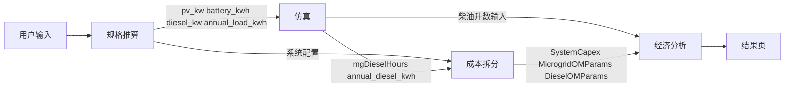

# 当前系统计算架构图

## 1. 总体架构图

```mermaid
flowchart TD
    A[前端配置输入] --> B{场景}
    B -->|已知负载| C[/api/optimize]
    B -->|DIY| D[/api/calculate?simulate=true]
    B -->|已知负载 选中方案后| D

    C --> C1[optimizer.py\n简化推荐模型]
    C1 --> C2[候选方案列表]
    C2 --> D

    D --> E[calculator.compute_sizes\n规格推算]
    E --> F{simulate}
    F -->|false| G[simulator.quick_estimate\n经验估算]
    F -->|true| H[simulator.run_pypsa]

    H --> H1[generate_pv_profile\n合成 PV 时序]
    H --> H2[generate_load_profile\n合成负荷时序]
    H --> H3[OffGridMicrogridSimulator\nPyPSA 调度仿真]

    G --> I[sim_r 仿真结果]
    H3 --> I

    E --> J[template_cost_engine.build_template_cost_breakdown\nCAPEX + 固定 O&M + 柴发维护参数]
    I --> J

    I --> K[economic_analysis.ProjectParameters\n燃油成本输入]
    J --> L[economic_analysis.generate_solution_report\n生命周期经济比较]
    K --> L

    L --> M[/api/calculate 响应]
    M --> N[结果页展示]
```

## 2. 数据流与公式关系图



## 3. 各层职责

### 3.1 规格推算层

源文件：`backend/app/services/calculator.py`

输出：

- `pv_capacity_kw`
- `battery_capacity_kwh`
- `diesel_capacity_kw`
- `inverter_count`
- `tray_count`
- `occupied_area_m2`

关键公式：

```text
pv_kw = bracketSets * panels_per_set * panel.kw
battery_kwh_target = max(pv_kw * 3 * storageDays, daily_load_kwh * autonomy_factor * storageDays / 0.9)
```

### 3.2 仿真层

源文件：

- `backend/app/services/simulator.py`
- `backend/app/services/microgrid_simulator.py`

两条分支：

- 快速估算：经验公式，快但粗
- 正式仿真：`8760h` PyPSA 调度

正式仿真网络包括：

- PV Generator
- Battery StorageUnit
- Diesel Generator
- Load
- Curtailment
- LoadShedding

关键建模假设：

- 柴油机 `p_min_pu=0.0`
- 电池 `cyclic_state_of_charge=True`
- 初始 SOC 为 `50%`
- 缺供通过 `LoadShedding` 表示

关键输出：

```text
solar_fraction   = pv_gen_kwh / load_kwh
loss_of_load     = load_shed_kwh / load_kwh
curtailment_rate = curtail_kwh / pv_gen_kwh
diesel_hours     = count(diesel_power > 0.01 kW)
```

### 3.3 成本层

源文件：

- `backend/app/services/template_cost_engine.py`
- `backend/app/services/economic_analysis.py`

CAPEX 包括：

- 光伏组件
- 支架
- 储能
- 柴油机
- 运输
- 安装
- 电气附件
- 其他初始成本

售价模型：

```text
equipment_subtotal = 所有 CAPEX 合计
profit_base = equipment_subtotal - diesel_generator_cost - installation_cost
selling_price = equipment_subtotal + profit_base * profit_margin
```

柴油维护 O&M 由运行小时驱动：

```text
annual_minor_services = ceil(runtime_hours / S_oil)
annual_air_filter_cost = ceil(runtime_hours / S_air) * C_af
```

### 3.4 经济分析层

源文件：`backend/app/services/economic_analysis.py`

当前经济分析做的是：

- 微电网方案
- 纯柴油方案

的逐年累计对比。

微电网年成本：

```text
Year 1 = selling_price + 柴发维护(B) + 微电网燃油
Year N = 固定光储 O&M + 柴发维护(B) + 微电网燃油
```

纯柴油年成本：

```text
Year N = 柴发维护(A) + 发电机购置/更换 + 纯柴油燃油
```

比较输出：

```text
annual_revenue     = diesel_cost - microgrid_cost
cumulative_revenue = 累计 annual_revenue
mg_lcoe            = 累计微电网成本 / 累计负荷
diesel_lcoe        = 累计纯柴油成本 / 累计负荷
```

## 4. 推荐链路与正式链路的关系

当前系统存在两条不同精度的链路：

### 4.1 推荐链路

入口：`/api/optimize`

特点：

- 用 `_solar_fraction()` 经验公式
- 不跑完整 PyPSA
- 用于给出候选方案排序

### 4.2 正式结果链路

入口：`/api/calculate?simulate=true`

特点：

- 走正式仿真
- 走正式成本拆分
- 走正式经济分析
- 结果页最终展示用这条链路

## 5. 当前架构的关键特点

优点：

- 分层清楚
- 推荐和正式计算分离
- 成本、仿真、经济结果可以分别替换

限制：

- 推荐链路和正式链路模型不一致
- 仿真层柴油机建模偏理想化
- 纯柴油对照场景不是同精度独立仿真
- 经济层更偏工程比较，不是 HOMER 的标准 NPC/COE 口径
