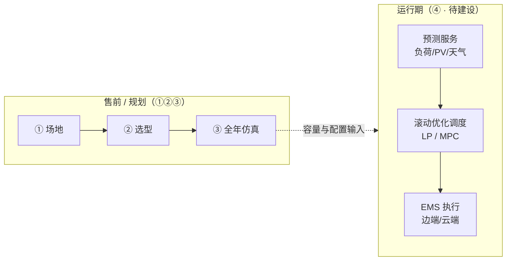
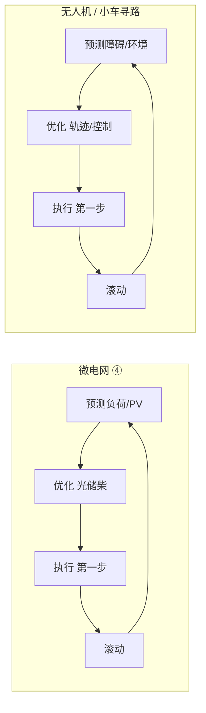

# 问题④：基于预测的光储柴调度优化 — 讲义（EMS 预测服务 · 后续实现）

> **定位：** 本节纳入「最优化问题」分享，不是因为泛泛介绍 MPC 教程，而是因为 **「预测 + 优化调度」本身是一类独立的优化问题** —— 将在 **EMS 预测服务** 中实现，与售前问题①②③ **并列、互补**。  
> **衔接：** [01_分享稿-完整版.md](./01_分享稿-完整版.md)、[03_一页总览与对照表.md](./03_一页总览与对照表.md)  
> **工程参考（可选阅读）：** `Learn-node`（BESS 平台）中「预测 + EMS + MPC」分层实现，见 [附录 A](#附录-a-learn-node-工程参考非本期范围)。

---

## 目录

1. [四个优化问题：为什么要有④](#1-四个优化问题为什么要有)  
2. [问题④ 定义：优化什么、在什么信息下优化](#2-问题定义)  
3. [与问题③ 的区别（必讲）](#3-与问题-的区别必讲)  
4. [EMS 预测服务：要做什么](#4-ems-预测服务要做什么)  
5. [怎么解：预测层 + 优化层](#5-怎么解预测层--优化层)  
6. [现网状态 vs 目标状态](#6-现网状态-vs-目标状态)  
7. [与售前三步链的关系](#7-与售前三步链的关系)  
8. [与电气/算法讨论要点](#8-与电气算法讨论要点)  
9. [PPT + 讲稿备注](#9-ppt--讲稿备注)  
10. [附录 A：Learn-node 工程参考](#附录-a-learn-node-工程参考非本期范围)  

---

## 1. 四个优化问题：为什么要有④

售前三步已经覆盖 **规划阶段** 的三类优化：

| # | 问题 | 阶段 | 状态 |
|---|------|------|------|
| ① | 最多能摆几套支架？ | 场地 / 容量上限 | **已上线**（MILP） |
| ② | 哪套光储柴最值得卖？ | 选型（known-load） | **已上线**（枚举+排序） |
| ③ | 8760h 怎么运行才最省？ | 售前仿真（定容后） | **已上线**（PyPSA LP / cc 规则） |

**④ 要解决的是另一阶段的问题：**

> 电站 **建成投运之后**，在 **未来不确定** 的负荷与光伏下，**每隔一段时间重新优化** 光储柴调度，并下发给现场 EMS 执行。

因此：

- **④ 也是优化问题**（有决策变量、目标函数、约束、求解器）。  
- **④ 不在售前 wizard 的主链路里完整实现**，而是 **EMS 预测服务** 的后续能力。  
- 分享里讲④，是为了说明 **产品线技术地图**：售前算「建什么」；EMS 预测服务算 **「运行期怎么开」**。



---

## 2. 问题定义

### 2.1 吸引式问法

**「不知道明天负荷和光照Exact值时，未来 6～24 小时光储柴该怎么排，才能少用油、少断电？」**

### 2.2 业务定义

| 项目 | 内容 |
|------|------|
| **阶段** | 运行期 / EMS（非售前一次性精算） |
| **输入** | 当前 SOC、设备状态；**预测**的未来负荷、PV；柴发/储能约束；可选天气 |
| **决策** | 未来各时段（或滚动窗内）PV 限发、储能充放、柴发出力等 |
| **目标** | 最小化运行成本（柴油、失负荷惩罚、电池损耗等）或跟踪经济性计划 |
| **输出** | 滚动更新的功率/启停计划 → EMS 下发 PCS/柴发 |
| **频率** | 15 min～1 h 级重算（非售前「全年一次」） |

### 2.3 数学定义（问题类型）

**「基于预测的优化调度」= 两层问题：**

```text
【层 A · 预测】（非优化，或含 ML 训练）
  给定：历史负荷、气象、季节、站点类型 …
  输出：未来 H 小时的负荷曲线 L̂(t)、光伏曲线 P̂(t)（可带区间/多情景）

【层 B · 优化】（本节强调的「优化问题」）
  给定：L̂(t)、P̂(t)，当前状态，设备容量（来自售前①②③）
  决策：u(t) = { P_pv_use, P_bat_ch, P_bat_dis, P_diesel, … }
  约束：功率平衡、SOC、柴发最小出力、储能/逆变器上限 …
  目标：min 运行成本 + 惩罚项
  类型：LP / MILP（离网柴发启停）/ 滚动 MPC（短窗反复求解）
```

**记忆句：** 预测回答「未来可能怎样」；优化回答「在该预测下，怎么开最划算」。

### 2.4 与「规则调度」不是同一类问题

| | 规则（如 cc 循环充电） | 问题④ 预测+优化 |
|---|------------------------|-----------------|
| 形式 | if-else | 数学规划 |
| 未来信息 | 往往不看或只看当前 | **显式用预测曲线** |
| 最优性 | 启发式 | 在给定预测下 **最优/近最优** |
| 产品 | 售前 `dieselDispatchMode=cc` | **EMS 预测服务**（目标） |

---

## 3. 与问题③ 的区别（必讲）

听众最容易混淆 **③ 售前运行仿真** 与 **④ EMS 预测调度**。必须用一张表讲透：

| 维度 | 问题③（售前） | 问题④（EMS 预测服务） |
|------|----------------|------------------------|
| **何时用** | 卖方案、写报告 | 电站运行、EMS 在线 |
| **时间跨度** | 常一次性 **8760h** | **滚动窗**（如 6～24h），周期性重算 |
| **负荷/光伏** | **已知曲线**（统计生成或历史；等价完美预见） | **预测曲线** \(\hat L,\hat{PV}\)，有误差 |
| **容量** | 来自② 或 DIY 手选 | 采用已交付配置（①② 结果） |
| **目标** | 支撑回本期、年油耗、太阳能占比 | 实时经济性、可靠性、减排 |
| **实现** | `run_pypsa` / `_run_homer_style_dispatch` | **待建：预测服务 + 滚动优化 API** |
| **产品入口** | `/api/calculate`、`/api/optimize` | EMS 边端/云端 + **预测服务** |
| **优化次数** | 每方案 1 次（或枚举多次） | 每天数十～数百次滚动 |

```text
问题③：  「假如全年曲线已经确定，这套设备怎么运行？」  → 规划/售前证据
问题④：  「曲线不确定，但预测明天会怎样，现在该怎么排？」 → 运行/EMS 能力
```

**产品上的 `prediction` 附加项（向导 Step8EMS）：**  
文案为「接入气象预报、预测发电与负荷、优化充放电」。当前售后端 mainly 用 `prediction` 切换精算为 **`lp` 模式**（仍多为 **全年已知曲线**），**不等于** 已具备完整的 **预测服务 + 滚动优化④**。④ 是 **后续要在 EMS 预测服务里落地的优化能力**。

---

## 4. EMS 预测服务：要做什么

### 4.1 服务边界（建议对电气对齐）

```text
┌─────────────────────────────────────────────────────────┐
│              EMS 预测服务（目标架构）                     │
├─────────────────────────────────────────────────────────┤
│  1. 数据采集     历史负荷、SCADA、气象 API、站点元数据      │
│  2. 预测模块     Ŝ_load(t+H), Ŝ_pv(t+H)  [+ 置信区间]    │
│  3. 调度优化     问题④：滚动 LP/MILP/MPC                 │
│  4. 计划下发     参考轨迹 / 功率设定值 → 边端 EMS           │
│  5. 反馈闭环     实测 vs 预测 → 下一窗重算                 │
└─────────────────────────────────────────────────────────┘
```

### 4.2 与向导「预测 EMS」addon 的关系

| 现网（售前） | 目标（运行） |
|--------------|--------------|
| `emsAddons` 含 `prediction` | 客户购买「预测调度」能力 |
| `products.yaml`：`prediction_control_usd` | 对应 EMS 预测服务 license/费用 |
| 精算：`emsControlMethod`/addon → `dispatch_mode=lp` | 运行：预测服务输出 **滚动优化** 计划 |
| 仍用 **全年固定曲线** 做 PyPSA | 用 **实时预测曲线** 做 **滚动优化** |

### 4.3 离网光储柴在④里的优化变量（讨论稿）

与并网储能「电价套利」不同，离网目标可设为：

```text
min  Σ_t [ c_fuel · P_diesel(t) + c_shed · P_load_shed(t) + c_deg · |P_bat(t)| + … ]
s.t. 功率平衡、SOC、柴发最小出力、PV/逆变器上限 …
      P_diesel, P_bat, curtailment, …
```

预测服务提供 \(\hat L(t),\widehat{PV}(t)\)；优化层与问题③ **同类（LP）**，但 **输入随滚动更新**。

---

## 5. 怎么解：预测层 + 优化层

### 5.1 预测层（EMS 预测服务 · 算法侧）

**要预测的对象（离网）：**

- 负荷（小时/15min）  
- 光伏出力（由辐照、云量、温度等推导）  
- 可选：柴发是否需要热备（天气驱动）

**方法（按成熟度选型，不在此讲义定稿）：**

- 统计/相似日、回归  
- 机器学习（LSTM、梯度提升等）  
- 数值天气预报 + 物理/半物理 PV 模型  

**输出给优化层：** 点预测曲线，或多情景 \(\{ \omega_s, \hat L_s, \widehat{PV}_s \}\)（随机/鲁棒优化用）。

### 5.2 优化层（问题④ 核心）

**典型实现路径（与 Learn-node「预测+优化」一致，见附录）：**

| 方案 | 说明 | 求解 |
|------|------|------|
| **滚动确定性 LP** | 每 15～60 min 用最新预测做 H 小时 LP，执行首段 | HiGHS（与现 PyPSA 栈一致） |
| **多情景随机 LP** | 预测多情景，优化期望成本 | LP / 随机规划 |
| **MPC** | 短窗 NLP/QP，分钟级追踪 | IPOPT 等（运行期） |

**滚动逻辑（与 MPC 思想一致，不必一步上完 MPC）：**

```text
每 Δt（如 15 min）:
  1. 拉取最新预测 Ŝ_load, Ŝ_pv
  2. 读当前 SOC、设备状态
  3. 求解窗内优化 → 控制序列 u*
  4. 执行 u*[0]（或前 k 步）
  5. Δt 后重复
```

### 5.3 与问题③ 代码的可复用性

| 模块 | 售前③ | EMS ④ |
|------|--------|--------|
| 网络构建 | `OffGridMicrogridSimulator` | 可复用，改 **snapshots=滚动窗** |
| 求解器 | HiGHS | 同 |
| 负荷/PV 序列 | `generate_*` 全年 | **预测服务 API** 注入 |
| 柴发规则 | `cc` 可选 | 优化层或规则 **分层**（优化主、规则兜底） |

---

## 6. 现网状态 vs 目标状态

| 能力 | 现网 | 目标（EMS 预测服务） |
|------|------|----------------------|
| 负荷/PV 预测 API | ❌ 无独立服务 | ✅ 预测服务 |
| 滚动优化调度 | ❌ | ✅ 问题④ |
| 售前展示 prediction | ✅ addon + LP 精算 | 与运行能力 **一致叙事** |
| 边端 EMS 执行 | ✅ 边端控制（规则为主） | 接收优化计划 |
| 云端/预测 addon | 产品配置 | 云端预测 + 下发 |

**对分享的一句话：**  
「④ 是 **要在 EMS 预测服务里建的优化问题**；售前 `prediction` 是 **产品承诺与方向**，精算里的 `lp` 是 **同类数学的简化预览**（全年完美预见），不是最终运行形态。」

---

## 7. 与售前三步链的关系

```text
售前签约前/方案阶段:
  ① MILP → max 套数 N
  ② optimize → 推荐套数、储、柴（known-load）
  ③ PyPSA → 年油耗、回本期、报告

投运后（EMS 预测服务）:
  设备容量固定（来自②/配置单）
  ④ 每 15min～1h:
       预测服务 → 滚动优化 → EMS 执行
       用实测反馈修正下一窗
```

**不是替代关系：** ①②③ 不会因为有④而消失；④ **消费** ①②③ 的 **容量结果**。

---

## 8. 与电气/算法讨论要点

1. **服务接口：** 预测服务输出格式（时间分辨率、长度 H、是否多情景）？优化服务输入/输出？  
2. **时间尺度：** 预测 1h 更新 vs 优化 15min 滚动 vs PCS 秒级 — 谁对齐谁？  
3. **柴发模型：** ④ 用 LP + 最小出力后处理，还是 MIP 启停，还是优化+规则兜底？  
4. **与③ 一致性：** 售前 LP 年结果 vs 运行滚动 LP — 客户预期如何管理？  
5. **降级：** 预测不可用 → 边端规则（cc）还是昨日计划？  
6. **部署：** 预测在云端、优化在边端还是全云端？延迟与断网。  
7. **验收指标：** 年油耗较③ 降低 x%、失负荷率、预测 MAPE 与优化收益的耦合。

---

## 8.1 延伸：MPC 不只在微电网 —— 与无人机 / 小车寻路同一类思想

> **分享时可自然引出：** 问题④ 若采用 **MPC（模型预测控制）** 实现滚动优化，与公司内 **无人机自动寻路、小车路径规划** 同事的工作 **是同一套控制范式**，便于算法/嵌入式同事横向交流。

### 8.1.1 MPC 的通用四步（与领域无关）

```text
1. 预测  用模型推演未来 N 步状态
2. 优化  在预测窗内求最优「控制量 / 轨迹」
3. 执行  只实施第一步
4. 滚动  用最新测量值重复
```

无论是 **储能调度** 还是 **小车/无人机寻路**，都是 **滚动时域优化（Receding Horizon）**，不是「算一整条轨迹一成不变执行到底」。

### 8.1.2 两个场景对照（给听众建立映射）

| 维度 | 微电网 EMS（问题④） | 无人机 / AGV 自动寻路 |
|------|---------------------|------------------------|
| **状态** | SOC、温度、母线功率 | 位置 \((x,y,z)\)、速度、航向 |
| **控制量** | 充放电功率、柴发出力、限发 | 加速度、角速度、推力、路径点 |
| **预测** | 负荷、光伏、天气 | 障碍物、风场、地图、他机轨迹 |
| **约束** | 功率平衡、SOC、柴发最小出力 | 动力学、避障、限速、转角率 |
| **目标** | 少油、少失负荷、少损耗 | 省时、省电、安全到达、平滑 |
| **典型周期** | 15 min～1 h 重算 | 0.1～1 s 重算 |
| **优化类型** | LP / MILP / NLP | 常 NLP、有时混合整数（避障离散） |



**一句话：** 都是 **「在预测的未来里求最优，只走一小步，再算」**。

### 8.1.3 为什么可以在分享里提无人机寻路

1. **帮助非电力同事听懂④：** 「就像小车每走一段重新规划路径，我们也是每隔一段时间重新规划充放电。」  
2. **促进协作：** EMS 预测服务（负荷/PV 预测 + 滚动优化）与 **感知/预测 + 路径优化** 团队在 **架构上可对标**（预测模块、优化模块、闭环反馈）。  
3. **技术栈可能有交集：** 建模（CasADi / Pyomo）、求解器（IPOPT、HiGHS）、滚动窗参数（N、Δt）、多情景鲁棒优化 —— 方法论可共享，**物理模型不同**。  
4. **明确差异，避免误解：** 微电网④ **不是** 做空间避障路径规划；无人机同事的工作 **不是** 算柴发 SOC —— **范式相同，问题定义不同**。

### 8.1.4 与问题① 场地 MILP 的区分（避免混淆）

| | 问题① 场地 MILP | 问题④ MPC/滚动优化 | 无人机路径规划 |
|---|-----------------|-------------------|----------------|
| **空间** | 2D 场地摆矩形 | 一般无空间路径 | 3D/2D 轨迹 |
| **时间** | 静态（一次算布局） | 动态滚动 | 动态滚动 |
| **决策** | 位置装/不装 | 功率时序 | 位置/速度时序 |
| **共性** | 都是 **优化** | 都是 **优化** | 都是 **优化** |

① 是 **静态组合优化**；④ 与寻路是 **动态序列优化** —— 分享时可说公司内同时有 **「静态摆法」** 和 **「动态滚动」** 两类优化实践。

### 8.1.5 对无人机同事的讨论邀请（会议可用）

- 预测窗长度 N、控制周期 Δt 如何选取？（储能分钟级 vs 飞行器百毫秒级）  
- 优化来不及算时如何降级？（规则 / 上一周期计划 / 安全停车）  
- 多机协同是否用分布式 MPC 或中央规划？（类比多储能站 / 多柴发）  
- 仿真闭环：数字孪生 + 滚动优化 —— BESS 仿真器 vs 飞行器仿真器结构是否类似  

---

## 9. PPT + 讲稿备注

### 第 1 页｜问题④：为什么放在「最优化」分享里

**幻灯片**

- ①②③ = **售前规划** 三类优化  
- ④ = **运行期**「预测 + 优化调度」— **也是优化问题**  
- 实现位置：**EMS 预测服务**（后续建设）

**讲稿备注**

- 明确：不是来讲 BESS 课程作业，是讲 **我们产品还要建的一类优化**。  
- 和电气开会的目的：对齐 **预测服务 + 优化调度** 的边界与接口。  

---

### 第 2 页｜问题④ 定义

**幻灯片**

- **输入：** 预测的未来负荷、PV + 当前状态 + 已定容量  
- **决策：** 各时段光储柴出力  
- **目标：** 少油、少失负荷、少损耗  
- **类型：** 滚动 LP / MILP / MPC  

**讲稿备注**

- 强调两层：预测（估计未来）+ 优化（在估计下最优）。  
- 优化层才是今天说的「第四个优化问题」。  

---

### 第 3 页｜与问题③ 的区别

**幻灯片**

| | ③ 售前 | ④ EMS |
|---|--------|-------|
| 曲线 | 已知全年 | 预测滚动 |
| 次数 | 少量 | 持续 |
| 目的 | 卖方案 | 运行 |

**讲稿备注**

- 用③ 给客户 **证明方案**；用④ **现场赚钱、省油**。  
- `prediction` addon 是产品方向，④ 是 **工程落地**。  

---

### 第 4 页｜EMS 预测服务架构

**幻灯片**

```text
数据 → 预测(负荷/PV) → 优化调度(④) → EMS 执行 → 反馈
```

**讲稿备注**

- 画在售前链路 **右侧**，投运后闭环。  
- 容量仍来自①②，不在④里重选套数。  

---

### 第 5 页｜现网 vs 目标

**幻灯片**

- 现网：prediction → 售前 LP 预览（全年曲线）  
- 目标：预测服务 + **滚动优化**  

**讲稿备注**

- 诚实说明进度，避免销售过度承诺「已具备滚动预测调度」。  

---

### 第 6 页｜讨论议题

**幻灯片**

- 接口、时间尺度、柴发模型、降级、部署、验收  

**讲稿备注**

- 用 §8 列表逐项收束，记录 action items。  

---

### 第 7 页｜同一类思想：MPC 与无人机 / 小车寻路

**幻灯片**

- MPC 四步：预测 → 优化 → 执行第一步 → 滚动  
- **微电网④：** 预测负荷/PV → 优化光储柴  
- **无人机/小车：** 预测障碍/环境 → 优化路径  
- **范式相同，物理问题不同** —— 欢迎寻路同事一起对表  

**讲稿备注**

- 自然点名：公司有同事做 **无人机自动寻路**，用的也是 **滚动优化 / MPC** 一族。  
- 不是要把④做成路径规划，而是说 **算法架构可横向交流**（预测服务 + 优化服务 + 闭环）。  
- 对比①：场地 MILP 是 **静态摆放**；④ 和寻路是 **动态滚动** —— 公司内两类优化都有。  

---

## 附录 A：Learn-node 工程参考（非本期范围）

> 路径：`C:\Panskai-work\Learn\05-优化求解\Skill-learn\Day4-5_储能优化-MILP建模\BESS-Optimization-Platform\Learn-node`  
> **用途：** 实现④ 时参考 **「预测 + 优化 + 滚动」** 的成熟范式；**并网储能** 场景，需映射到离网光储柴。

### A.1 三种调度（`13_三种调度方式对比.md`）

| 方式 | 说明 | 与我们的对应 |
|------|------|--------------|
| 规则 | 只看现在 | 边端 cc / 保护兜底 |
| 优化 | 未来已知 | 售前③ PyPSA |
| **预测+优化** | 先预测再优化 | **④ 目标** |

### A.2 分层（`05_EMS.md`、`08_仿真器.md`）

```text
EMS (1h)  随机/情景优化 → 日计划
MPC (1min) 追踪 + 约束
PID (4s)   跟功率
```

离网映射：④ 可先做 **滚动 LP（小时/15min）**，MPC 可作为 **二期** 提高追踪精度。

### A.3 MPC（`04_模型预测控制_MPC.md`）

- **模型预测控制 MPC**（勿写成 MCP）  
- 预测窗内优化，**只执行第一步**，滚动重复  
- 与④ 的「滚动 LP」思想相同，实现形式可不同  

### A.4 推荐阅读顺序

1. `13_三种调度方式对比.md`  
2. `05_能量管理系统_EMS.md`  
3. `04_模型预测控制_MPC.md`（若做分钟级 MPC）  
4. `11_离网微电网频率控制.md`（离网 EMS vs 频率控制分工）  

---

## 收束（分享结尾可用）

> 售前有 **三个** 优化问题：占地、选型、全年仿真；  
> 投运后还有 **第四个**：在 **EMS 预测服务** 里，用 **预测曲线 + 滚动优化** 持续调度光储柴。  
> ③ 回答「方案好不好」；④ 回答「建好后每一天怎么开更好」—— **都是优化，阶段不同、输入不同、要实现的位置不同。**  
> 若④ 采用 **MPC** 实现滚动优化，与 **无人机 / 小车自动寻路** 是 **同一控制范式**（预测窗内优化、只执行第一步）：**问题不同，方法论可横向协作。**
