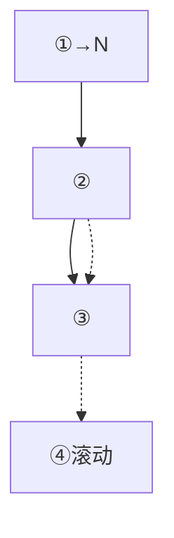
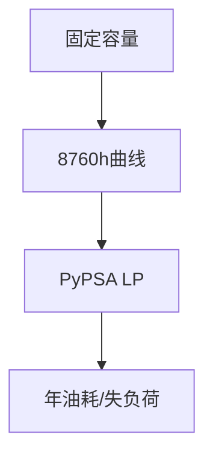
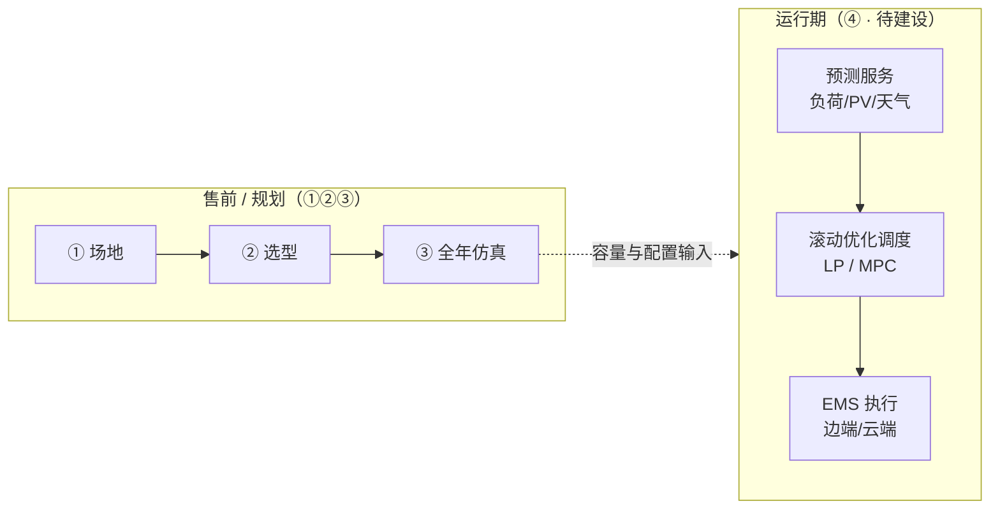
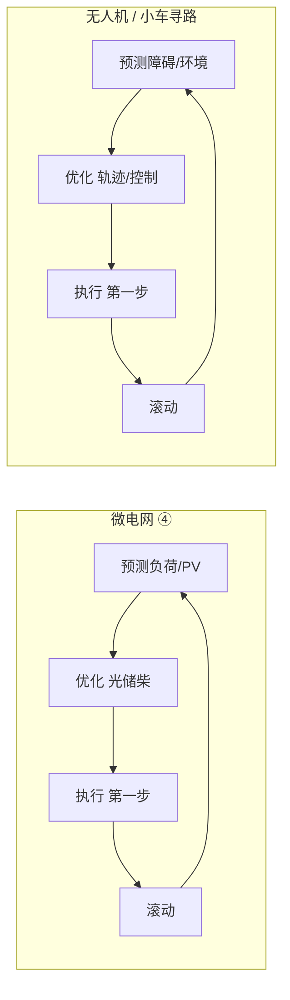
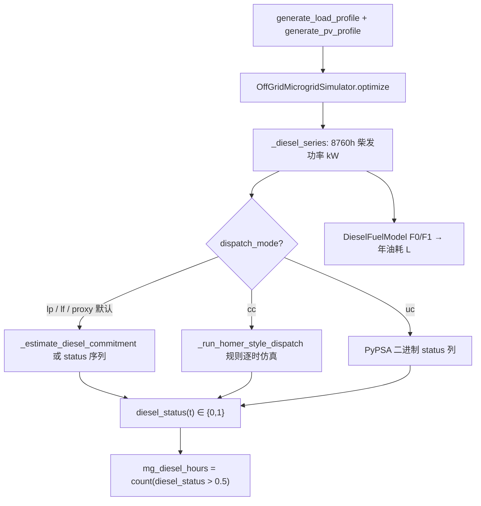
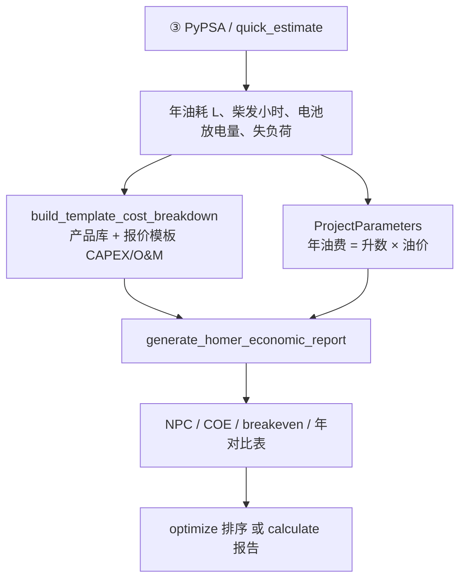

# 微电网售前与运行期：四个最优化问题 — 单文档完整版

> **本文档是唯一推荐阅读与讲解材料。** 已汇总 05/01/03/04/02 讲义及 BESS Learn-node 要点。  
> **版本：** 2026 · **仓库：** MicroGrid-homerpro

---

## 如何使用本文档

| 你想… | 跳到 |
|--------|------|
| 5 分钟全局观 | [§0](#0-一句话与四问题总表) |
| 售前三问题 | [§2～4](#2-问题一场地) |
| 双路径 | [§1](#1-售前在解决什么) |
| HOMER 对比 | [§8](#8-与-homer-pro-对比) |
| 柴发小时 / HOMER 对齐 | [§8.4～8.6](#84-柴发运行小时怎么算) |
| 经济分析 / HOMER | [§8.7](#87-经济分析怎么算和-homer-pro-一样吗) |
| 预测调度④ | [§6](#6-问题四基于预测的调度优化) |
| BESS 参考 | [§7](#7-bess-平台知识汇总) |
| **给别人讲** | **[§10](#10-给他人讲解指南)** |
| 速查 FAQ | [§9](#9-速查表faq-与代码索引) |

**自学：** 0→1→2→3→4→5→6→7→9 · **开讲：** 只看 [§10](#10-给他人讲解指南)

---

## 目录

1. [售前场景](#1-售前在解决什么) · 2. [问题①](#2-问题一场地) · 3. [问题②](#3-问题二选型) · 4. [问题③](#4-问题三运行) · 5. [串联](#5-三问题串联) · 6. [问题④](#6-问题四基于预测的调度优化) · 7. [BESS](#7-bess-平台知识汇总) · 8. [HOMER](#8-与-homer-pro-对比) · 9. [FAQ](#9-速查表faq-与代码索引) · 10. [讲解指南](#10-给他人讲解指南)


---

## 0. 一句话与四问题总表

**售前：** ①地能装几套 → ②哪套最划算 → ③全年怎么开最省。**投运：** ④预测下滚动调度。

| # | 大白话 | 数学 | API | 状态 |
|---|--------|------|-----|------|
| ① | 地最多几套 | MILP | /api/layout | ✅ |
| ② | 1…N最划算 | 枚举+排序 | /api/optimize | ✅ |
| ③ | 全年怎么开 | LP | calculate | ✅ |
| ④ | 投运怎么开 | 预测+滚动 | EMS待建 | 🔜 |

**餐厅类比：** ①最多摆桌 · ②哪套回本快 · ③全年怎么开火 · ④每天看预报调班。




## 1. 售前在解决什么：两种场景

### 1.1 入口不是单一路径

向导第一步选择场景（`frontend/.../Step1Scenario.tsx`），决定 **负荷从哪来、容量由谁确定、是否自动比方案**。

| 场景 | 名称 | 客户情况 | 负荷 | 容量谁定 | 主接口 |
|------|------|----------|------|----------|--------|
| **known-load** | 已知负载 | 有年 kWh / 账单，要回本期、比方案 | 用户输入年用电量 → 后端合成 8760h | **系统** `/api/optimize` | optimize → 选方案 → calculate |
| **diy** | DIY | 设备清单已定，要验证运行 | **无可靠年 kWh** | **用户手选** 套数/逆变器/pack/柴发 | 直接 `calculate` |
| no-load | 标准产品 | 早期规划 | 托盘/标准推算 | 标准配置 | calculate |

自定义流程（custom）在分支弹窗中选择 known-load 或 diy，步骤与上表对应分支一致（`wizardFlow.ts`）。

### 1.2 已知负载：要回答什么

1. **地能装几套？** → 问题 ①  
2. **在 1…N 套里哪套光储柴最划算？** → 问题 ②  
3. **每套一年怎么运行、多少油、会不会常断电？** → 问题 ③  

配置逻辑：

```text
场地 → max N 套
年负荷 + 经纬度
  → POST /api/optimize（for sets=1..N → PyPSA → 经济性）
  → 用户选方案
  → POST /api/calculate 精算
```

### 1.3 DIY：要回答什么

1. **地最多几套？自选套数是否 ≤ N？** → 问题 ① + 用户自选  
2. **手选配置是否合理？** → **不跑** optimize（无问题 ② 自动寻优）  
3. **定稿后全年运行与粗算经济？** → 问题 ③  

配置逻辑：

```text
场地 → max N
用户手选：套数、逆变器、电池包、柴发
  → POST /api/calculate（compute_sizes + PyPSA）
  → 经济性为估算（产品文案：±20～30%）
```

### 1.4 三问题在两条路径上的出现

| 优化问题 | known-load | DIY |
|----------|------------|-----|
| ① 场地 | ✅ MILP / 面积 | ✅ 上限；套数手选 |
| ② 选型 | ✅ optimize | ❌ 人定 |
| ③ 运行 | ✅ 每候选 + 精算 | ✅ 一次 calculate |

---

## 2. 问题一：场地

### 通俗 · 问题一：这块地最多能装几套光伏？

### 用大白话说

客户有一块地，形状可能不规则（L 形、三角形、有凹角）。我们要在上面摆光伏支架。每套支架是一个固定大小的长方形（大约 28 米 × 5.6 米），支架之间还要留通道（大约 3 米间距）。

**问题就是：在这块地上，最多能塞进去几套支架？**

### 为什么这是个"优化问题"

如果地是规规矩矩的长方形，你用除法就能算出来。但现实中：

- 地可能是不规则多边形
- 支架可以横放也可以竖放
- 不同摆法能装的数量不一样
- 你要找到那个"装得最多"的摆法

这就像俄罗斯方块——同样的空间，摆法不同，能塞进去的数量就不同。你要找到最优的摆法。

### 怎么解决的

把每个"可能放支架的位置"标记出来，然后问：哪些位置可以同时放（不冲突），怎样选才能选最多？

这在数学上叫 **0-1 整数规划**：每个位置要么放（1）要么不放（0），目标是让放的总数最多，约束是互相冲突的位置不能同时放。

用求解器（HiGHS）几秒钟就能算出来。

### 这个问题的输出是什么

**一个数字 N** — 比如"这块地最多能装 8 套光伏支架"。

这个 N 就是后面所有计算的天花板。你不可能装 9 套，但可以选择只装 3 套、5 套或 8 套。

### 一句话总结

> **问题一回答的是：地给了多大的上限。**

---

---

### 技术详解 · 问题一 — 最多能摆几套支架？

### 3.1 业务问题

**吸引式问法：** 在不规则场地、支架不能重叠、需满足间距时，怎样摆才能 **装得最多**？

- **决策：** 候选位置是否安装一套标准支架（横放/竖放）。  
- **目标：** 最大化套数（= PV 硬上限）。  
- **不回答：** 发电量、回本期、储能与柴发容量。

### 3.2 数学定义（MILP）

对每个候选位置 \(i\)：

- 变量：\(x_i \in \{0,1\}\)  
- 目标：\(\max \sum_i x_i\)  
- 约束：若 \(i,j\) 重叠（含间距）则 \(x_i + x_j \le 1\)

实现：`layout_optimizer._solve_milp_mixed`，求解器 **HiGHS**（`highspy`）。

### 3.3 求解流程

```text
1. 输入多边形顶点（米）或仅面积
2. 多角度扫描 + 枚举候选中心（横/竖放）
3. 过滤：矩形在场地内
4. 建冲突对 → MILP → HiGHS
5. 大场地：凸分解、分块求解、合并校验
6. 失败：贪心 _greedy_mixed
```

**两种入口（`routers/layout.py`）：**

| 输入 | 方法 | strategy 示例 |
|------|------|----------------|
| polygon ≥3 点 | `optimize_polygon_layout` | MILP mixed-orientation |
| 仅 availableAreaM2 | `max_systems_for_area` | area-based estimate（非 MILP） |

产品尺寸默认来自 `products.yaml`（支架长约 28 m、宽约 5.6 m、间距约 3.048 m）。

### 3.4 输入输出

- **入：** 多边形、`timeLimitS`（默认 120s）、可选间距/支架尺寸覆盖  
- **出：** `maxSystems`、`rectangles`（可选布局图）  
- **前端：** `SiteAreaMap` → `config.maxBracketSetsByLayout`

### 3.5 与问题 ② 的链路

```text
问题① → N
问题② → sets ∈ {1,…,N}  （known-load）
       或 user_sets ≤ N （DIY）
```

① 只提供 **天花板**，不在 1…N 中替你选最优套数。

---

### 2.5 流程图（问题一）

```mermaid
flowchart TD
  A[SiteAreaMap] --> B{多边形/面积}
  B -->|多边形| C[/api/layout]
  B -->|面积| D[max_systems_for_area]
  C --> E[optimize_polygon_layout]
  E --> F[MILP HiGHS]
  F --> G[max_systems=N]
```


## 3. 问题二：选型

### 通俗 · 问题二：装几套、配多少电池和柴发最划算？

### 用大白话说

问题一告诉你最多能装 8 套。但装 8 套不一定最划算——光伏多了，电池也要跟着大，投资就高了。也许装 5 套，配合适当的电池和一台柴油发电机，回本期反而最短。

**问题就是：在 1 到 N 套之间，哪个方案的投资回报最好？**

### 为什么这是个"优化问题"

因为你有多个选择，每个选择的成本和收益不同：

| 方案 | 光伏 | 电池 | 柴发 | 投资 | 年省油费 | 回本期 |
|------|------|------|------|------|----------|--------|
| 装 3 套 | 少 | 小 | 大 | 低 | 少 | 可能长 |
| 装 5 套 | 中 | 中 | 中 | 中 | 中 | 可能最短 |
| 装 8 套 | 多 | 大 | 小 | 高 | 多 | 可能又变长 |

你要在这些方案里找到"最值得卖给客户"的那个。

### 这里面的逻辑

对于每个套数（比如 1 套、2 套、3 套……一直到 N 套）：

1. **光伏容量**：套数 × 每套的板数 × 每块板的功率 → 确定
2. **电池容量**：根据光伏大小和用电需求，用公式算出需要多少电池包 → 确定
3. **柴油发电机**：根据峰值负荷选一个标准档位 → 确定
4. **全年运行**：调用问题三，算出这个配置一年用多少油、会不会断电
5. **经济性**：算投资、年收益、回本期、净现值

然后把所有方案按回本期排序，选出最好的推荐给客户。

### 为什么不是"一个大公式直接算出最优"

因为光伏、电池、柴发之间的关系不是简单的线性关系。装更多光伏不一定更好——可能电池跟不上，或者投资太高回不了本。唯一靠谱的办法就是**每个方案都算一遍**，然后比较。

这就像买车——你不能用一个公式算出"最适合你的车"，你得把几款候选车的油耗、保险、维修、舒适度都列出来比较。

### 这个问题的输出是什么

**一个排好序的方案列表**，比如：

- 推荐方案：5 套光伏 + 10 个电池包 + 60kW 柴发，回本期 4.2 年
- 次优方案：6 套光伏 + 12 个电池包 + 60kW 柴发，回本期 4.5 年
- 备选方案：4 套光伏 + 8 个电池包 + 80kW 柴发，回本期 5.1 年

### 一句话总结

> **问题二回答的是：在能装的范围内，哪个配置最值得买。**

---

---

### 技术详解 · 问题二 — 哪套光储柴最值得卖？

> **仅 known-load 路径调用。** DIY 跳过本节 API。

### 4.1 业务问题

**吸引式问法：** 最多只能装 N 套时，装几套、配多少电池和多大柴发，**回本期最好且可靠性可接受**？

- **决策：** 离散方案（套数、PV、pack、柴发等）。  
- **目标：** 按 `objective`（如 payback）排序，标推荐/次优/备选。  
- **不决策：** 每小时调度（属问题 ③）。

### 4.2 数学定义（当前：搜索 + 排序）

```text
对每个候选 c：
  R(c) = 问题③( 固定容量(c) )
  E(c) = 经济性( CAPEX(c), R(c), 油价, … )
按 score 排序
```

**候选生成（当前实现，`optimizer.py`）：**

| 变量 | 确定方式 |
|------|----------|
| sets | **for** min…max（max 来自 ①） |
| PV kW | sets × panels_per_set × panel.kw |
| num_packs | ceil(target_kwh / pack_kwh)，target 见下式 |
| diesel_kw | **整次请求开始时定一次**，所有 sets 共用 |

```text
target_kwh = max(
  pv_kw * 3 * storage_days,
  (annual_load/365) * autonomy_factor * storage_days / 0.9
)
autonomy_factor = 0.5（有柴发）或 1.0
```

柴发档位：`_STANDARD_DIESEL_KW` = 10,15,20,…,200，或用户已有/指定机组。

**类型名称：** 离散枚举 + 打分；**不是** PV×储×柴 的笛卡尔积，也 **不是** 联合容量 LP。

### 4.3 求解流程（`optimize_with_diagnostics`）

```text
准备：
  - catalog：板/支架/电池包
  - effective_max_sets = min(配置上限, ①的N)
  - diesel_kw 一次
  - 有经纬度：generate_load_profile + generate_pv_profile
  - 可选：DieselOnlySimulator 纯柴油基准 1 次

循环 sets = 1 .. effective_max_sets：
  - _candidate_size(sets)
  - 若在精算集：_pypsa_simulation → ③
  - 否则：quick_estimate
  - template_cost + homer_economic_model → payback, NPV, score
  - loss_of_load > 1% → is_reliability_risk

候选过多时：
  - 全 sets quick_estimate
  - Top ~6 邻域 + min/max → 最多 ~10 套 PyPSA

排序输出 → 方案1/2/3 标签
```

**API：** `POST /api/optimize`  
**前端：** `useWizardCalculation`（`scenario === 'known-load'`）→ `PlanSelectionPage` → `handlePlanSelect`。

### 4.4 与 ①、③ 的关系

- **输入依赖 ①：** `maxBracketSets`  
- **每个候选必须调 ③**（或 quick 近似）才有可信油耗与失负荷  
- **选定后** 仍调 ③ 一次（`calculate` 精算）

### 4.5 DIY 下的「问题二」

用户通过 `diy-pv-setup`、`diy-storage`、`diy-generator` **手填**；`compute_sizes` 汇总后直接进入 ③，**无方案列表排序**。

---

### 3.6 流程图（问题二）

```mermaid
flowchart TD
  A[known-load] --> B[/api/optimize]
  B --> C[for sets 1..N]
  C --> D[③ PyPSA or quick]
  D --> E[排序→calculate]
```


## 4. 问题三：运行

### 通俗 · 问题三：配置定了之后，一年 8760 小时怎么运行最省？

### 用大白话说

现在设备都买好了——5 套光伏、10 个电池包、一台 60kW 柴发。问题是：

- 白天光伏发电多的时候，是先给负载用，还是先充电池？
- 晚上没太阳了，是先放电池，还是先开柴发？
- 电池充到多满才停？放到多空才切换？
- 柴发什么时候开、开多大功率？

**一年有 8760 个小时，每个小时都要做这些决策。怎么安排才能全年用油最少、断电最少？**

### 为什么这是个"优化问题"

因为每个小时的决策会影响后面的小时。比如：

- 下午 3 点把电池充满了，晚上就不用开柴发 → 省油
- 但如果下午 3 点不充电池，把光伏电全给负载用，晚上电池没电就得开柴发 → 费油
- 更复杂的是：明天是阴天，今天是不是应该多充一点电池备着？

这不是一个小时一个小时独立决策就能解决的——你需要**全局考虑**整年的光照、负荷变化，找到一个整体最优的运行策略。

### 和问题二的区别（非常重要）

| | 问题二 | 问题三 |
|---|--------|--------|
| 问的是 | **买多大**的设备 | 设备买好后**怎么用** |
| 容量 | 在变（比较不同套数） | 固定不变 |
| 类比 | 选哪款车 | 每天怎么开最省油 |

问题二调用问题三——每个候选方案都要跑一次问题三，才能知道这个方案一年用多少油。

### 怎么解决的

把一年 8760 个小时的所有决策变量（每小时光伏出力、电池充放、柴发出力、弃光、断电）放在一起，建一个大的线性规划（LP）模型：

- **目标**：最小化全年运行成本（油费 + 断电惩罚）
- **约束**：
  - 每小时供需平衡（发的 = 用的 + 充的 - 放的）
  - 电池不能超过容量上限
  - 柴发不能超过额定功率
  - 光伏不能超过当时的日照条件

求解器一次性算出 8760 个小时的最优调度方案。

### 这个问题的输出是什么

- 全年柴油消耗量（升）
- 全年断电时长（小时）
- 全年弃光比例
- 电池循环次数
- 每小时的功率分配时序图

这些数字直接写进客户报告里，是客户决定买不买的关键依据。

### 一句话总结

> **问题三回答的是：设备定了之后，全年怎么运行最经济。**

---

---

### 技术详解 · 问题三 — 8760h 怎么才最省？

### 5.1 业务问题

**吸引式问法：** 容量已定，每个时刻怎么发、充放、开油机，**全年运行成本最小且尽量少断电**？

### 5.2 数学定义（LP）

- 时段 \(t=1..8760\)（或更细）  
- 固定：pv_kw, battery_kwh, battery_power_kw, diesel_kw  
- 优化：各时段功率、储能 SOC 等  
- 目标：最小化运行边际成本（柴发、失负荷惩罚、弃光等）  
- 实现：`OffGridMicrogridSimulator.build_network()` → `n.optimize(solver_name="highs")`

网络主要组件：

| 组件 | 作用 |
|------|------|
| PV | 边际成本 0，受 p_max_pu 限制 |
| StorageUnit | 充放电、SOC、效率 |
| Diesel | 边际成本 ∝ 油价/效率；可最小出力 |
| Load | 固定曲线 |
| Curtailment | 弃光 |
| LoadShedding | 高惩罚，失负荷 |

`dispatch_mode == "uc"` 时柴发 committable → **MIP**；常见 lf/lp/cc 以 **LP + 后处理油耗** 为主。

### 5.3 求解流程（`run_pypsa` / `_run_pypsa_cached`）

```text
1. generate_load_profile(年kWh, loadType, year)
2. generate_pv_profile(lat, lon, year, pv_kw, 修正系数)
3. OffGridMicrogridSimulator → build_network → optimize
4. 汇总年发电、失负荷、弃电、柴油时序
5. DieselFuelModel：时序 → 年升（F0/F1 线性油耗）
6. cc 模式：可 _run_homer_style_dispatch 修正柴油统计
7. DieselOnlySimulator：纯柴油对照
8. 返回 sim_r → optimize 或 calculate
```

### 5.4 与问题 ② 的分工

| | ② 选型 | ③ 运行 |
|---|--------|--------|
| 问 | 买多大 | 怎么用 |
| 容量 | 变（枚举）或手定 | **固定** |
| 数学 | 枚举+排序 | LP 8760 联合 |

### 5.5 调度模式（与电气讨论）

| 模式 | 说明 | 柴发小时统计 |
|------|------|----------------|
| **proxy**（默认） | LP 求出力 → 阈值 + 最小开停机代理 | `count(status>0.5)` |
| lf / lp | 连续经济调度 + 后处理 | 同 proxy 思路 |
| cc | 规则逐时 `_run_homer_style_dispatch` **覆盖**油耗与小时 | 规则仿真内统计 |
| uc | PyPSA 二进制启停（慢，验证用） | `generators_t.status` |
| prediction（EMS） | 精算时可走 lp；与④衔接 | 同 lp/proxy |

> 柴发小时与 HOMER 对齐细节见 [§8.4](#84-柴发运行小时怎么算)。

---

### 4.6 流程图（问题三）




---

## 5. 三问题串联

见下文完整例子与 §01 双路径。求解器：①若干MILP + ②③≤10次PyPSA + 精算1次。


### 5.1 完整业务例子串起来

**客户说：** "我在非洲有一块 2000 平米的不规则空地，年用电 50 万度，帮我设计一套光储柴系统。"

**系统做的事：**

**第一步（问题一）：** 把这块地的形状输入系统，算出最多能装 7 套光伏支架。

**第二步（问题二）：** 分别计算装 1 套、2 套、3 套……7 套时，各需要多少电池和多大柴发，每个方案的回本期是多少。结果发现装 4 套回本期最短（5.1 年），装 5 套次之（5.4 年）。

**第三步（问题三）：** 对推荐的 4 套方案，详细计算全年 8760 小时的运行情况——年用油 12000 升，断电 23 小时（占比 0.26%），电池日均循环 0.8 次。这些数字写进报告给客户。

**客户拿到报告：** "4 套光伏 + 8 个电池包 + 60kW 柴发，投资 XX 万，5.1 年回本，年省油费 XX 万。"

---

### 5.3 双路径完整链路

### 6.1 已知负载

```text
选 known-load
→ 地点/面积/地图（① 可选 MILP → N）
→ 年负荷、柴发、电压、EMS
→ POST /api/optimize（②+③）
→ 方案选择
→ POST /api/calculate（③ 精算 + 报告）
```

求解器量级（N=8、两阶段预筛）：① 若干次 MILP；②③ 1×纯柴油 + ≤10×微电网 PyPSA；精算 +1×PyPSA。

### 6.2 DIY

```text
选 DIY
→ diy-area-setup（①）
→ diy-pv / inverter / storage / generator（手选）
→ POST /api/calculate（仅③ + 估算经济）
```

---

## 6. 问题四：基于预测的调度优化

### 1. 四个优化问题：为什么要有④

售前三步已经覆盖 **规划阶段** 的三类优化：

| # | 问题 | 阶段 | 状态 |
|---|------|------|------|
| ① | 最多能摆几套支架？ | 场地 / 容量上限 | **已上线**（MILP） |
| ② | 哪套光储柴最值得卖？ | 选型（known-load） | **已上线**（枚举+排序） |
| ③ | 8760h 怎么运行才最省？ | 售前仿真（定容后） | **已上线**（PyPSA LP / cc 规则） |

**④ 要解决的是另一阶段的问题：**

> 电站 **建成投运之后**，在 **未来不确定** 的负荷与光伏下，**每隔一段时间重新优化** 光储柴调度，并下发给现场 EMS 执行。

因此：

- **④ 也是优化问题**（有决策变量、目标函数、约束、求解器）。  
- **④ 不在售前 wizard 的主链路里完整实现**，而是 **EMS 预测服务** 的后续能力。  
- 分享里讲④，是为了说明 **产品线技术地图**：售前算「建什么」；EMS 预测服务算 **「运行期怎么开」**。



---

### 2. 问题定义

#### 2.1 吸引式问法

**「不知道明天负荷和光照Exact值时，未来 6～24 小时光储柴该怎么排，才能少用油、少断电？」**

#### 2.2 业务定义

| 项目 | 内容 |
|------|------|
| **阶段** | 运行期 / EMS（非售前一次性精算） |
| **输入** | 当前 SOC、设备状态；**预测**的未来负荷、PV；柴发/储能约束；可选天气 |
| **决策** | 未来各时段（或滚动窗内）PV 限发、储能充放、柴发出力等 |
| **目标** | 最小化运行成本（柴油、失负荷惩罚、电池损耗等）或跟踪经济性计划 |
| **输出** | 滚动更新的功率/启停计划 → EMS 下发 PCS/柴发 |
| **频率** | 15 min～1 h 级重算（非售前「全年一次」） |

#### 2.3 数学定义（问题类型）

**「基于预测的优化调度」= 两层问题：**

```text
【层 A · 预测】（非优化，或含 ML 训练）
  给定：历史负荷、气象、季节、站点类型 …
  输出：未来 H 小时的负荷曲线 L̂(t)、光伏曲线 P̂(t)（可带区间/多情景）

【层 B · 优化】（本节强调的「优化问题」）
  给定：L̂(t)、P̂(t)，当前状态，设备容量（来自售前①②③）
  决策：u(t) = { P_pv_use, P_bat_ch, P_bat_dis, P_diesel, … }
  约束：功率平衡、SOC、柴发最小出力、储能/逆变器上限 …
  目标：min 运行成本 + 惩罚项
  类型：LP / MILP（离网柴发启停）/ 滚动 MPC（短窗反复求解）
```

**记忆句：** 预测回答「未来可能怎样」；优化回答「在该预测下，怎么开最划算」。

#### 2.4 与「规则调度」不是同一类问题

| | 规则（如 cc 循环充电） | 问题④ 预测+优化 |
|---|------------------------|-----------------|
| 形式 | if-else | 数学规划 |
| 未来信息 | 往往不看或只看当前 | **显式用预测曲线** |
| 最优性 | 启发式 | 在给定预测下 **最优/近最优** |
| 产品 | 售前 `dieselDispatchMode=cc` | **EMS 预测服务**（目标） |

---

### 3. 与问题③ 的区别（必讲）

听众最容易混淆 **③ 售前运行仿真** 与 **④ EMS 预测调度**。必须用一张表讲透：

| 维度 | 问题③（售前） | 问题④（EMS 预测服务） |
|------|----------------|------------------------|
| **何时用** | 卖方案、写报告 | 电站运行、EMS 在线 |
| **时间跨度** | 常一次性 **8760h** | **滚动窗**（如 6～24h），周期性重算 |
| **负荷/光伏** | **已知曲线**（统计生成或历史；等价完美预见） | **预测曲线** \(\hat L,\hat{PV}\)，有误差 |
| **容量** | 来自② 或 DIY 手选 | 采用已交付配置（①② 结果） |
| **目标** | 支撑回本期、年油耗、太阳能占比 | 实时经济性、可靠性、减排 |
| **实现** | `run_pypsa` / `_run_homer_style_dispatch` | **待建：预测服务 + 滚动优化 API** |
| **产品入口** | `/api/calculate`、`/api/optimize` | EMS 边端/云端 + **预测服务** |
| **优化次数** | 每方案 1 次（或枚举多次） | 每天数十～数百次滚动 |

```text
问题③：  「假如全年曲线已经确定，这套设备怎么运行？」  → 规划/售前证据
问题④：  「曲线不确定，但预测明天会怎样，现在该怎么排？」 → 运行/EMS 能力
```

**产品上的 `prediction` 附加项（向导 Step8EMS）：**  
文案为「接入气象预报、预测发电与负荷、优化充放电」。当前售后端 mainly 用 `prediction` 切换精算为 **`lp` 模式**（仍多为 **全年已知曲线**），**不等于** 已具备完整的 **预测服务 + 滚动优化④**。④ 是 **后续要在 EMS 预测服务里落地的优化能力**。

---

### 4. EMS 预测服务：要做什么

#### 4.1 服务边界（建议对电气对齐）

```text
┌─────────────────────────────────────────────────────────┐
│              EMS 预测服务（目标架构）                     │
├─────────────────────────────────────────────────────────┤
│  1. 数据采集     历史负荷、SCADA、气象 API、站点元数据      │
│  2. 预测模块     Ŝ_load(t+H), Ŝ_pv(t+H)  [+ 置信区间]    │
│  3. 调度优化     问题④：滚动 LP/MILP/MPC                 │
│  4. 计划下发     参考轨迹 / 功率设定值 → 边端 EMS           │
│  5. 反馈闭环     实测 vs 预测 → 下一窗重算                 │
└─────────────────────────────────────────────────────────┘
```

#### 4.2 与向导「预测 EMS」addon 的关系

| 现网（售前） | 目标（运行） |
|--------------|--------------|
| `emsAddons` 含 `prediction` | 客户购买「预测调度」能力 |
| `products.yaml`：`prediction_control_usd` | 对应 EMS 预测服务 license/费用 |
| 精算：`emsControlMethod`/addon → `dispatch_mode=lp` | 运行：预测服务输出 **滚动优化** 计划 |
| 仍用 **全年固定曲线** 做 PyPSA | 用 **实时预测曲线** 做 **滚动优化** |

#### 4.3 离网光储柴在④里的优化变量（讨论稿）

与并网储能「电价套利」不同，离网目标可设为：

```text
min  Σ_t [ c_fuel · P_diesel(t) + c_shed · P_load_shed(t) + c_deg · |P_bat(t)| + … ]
s.t. 功率平衡、SOC、柴发最小出力、PV/逆变器上限 …
      P_diesel, P_bat, curtailment, …
```

预测服务提供 \(\hat L(t),\widehat{PV}(t)\)；优化层与问题③ **同类（LP）**，但 **输入随滚动更新**。

---

### 5. 怎么解：预测层 + 优化层

#### 5.1 预测层（EMS 预测服务 · 算法侧）

**要预测的对象（离网）：**

- 负荷（小时/15min）  
- 光伏出力（由辐照、云量、温度等推导）  
- 可选：柴发是否需要热备（天气驱动）

**方法（按成熟度选型，不在此讲义定稿）：**

- 统计/相似日、回归  
- 机器学习（LSTM、梯度提升等）  
- 数值天气预报 + 物理/半物理 PV 模型  

**输出给优化层：** 点预测曲线，或多情景 \(\{ \omega_s, \hat L_s, \widehat{PV}_s \}\)（随机/鲁棒优化用）。

#### 5.2 优化层（问题④ 核心）

**典型实现路径（与 Learn-node「预测+优化」一致，见附录）：**

| 方案 | 说明 | 求解 |
|------|------|------|
| **滚动确定性 LP** | 每 15～60 min 用最新预测做 H 小时 LP，执行首段 | HiGHS（与现 PyPSA 栈一致） |
| **多情景随机 LP** | 预测多情景，优化期望成本 | LP / 随机规划 |
| **MPC** | 短窗 NLP/QP，分钟级追踪 | IPOPT 等（运行期） |

**滚动逻辑（与 MPC 思想一致，不必一步上完 MPC）：**

```text
每 Δt（如 15 min）:
  1. 拉取最新预测 Ŝ_load, Ŝ_pv
  2. 读当前 SOC、设备状态
  3. 求解窗内优化 → 控制序列 u*
  4. 执行 u*[0]（或前 k 步）
  5. Δt 后重复
```

#### 5.3 与问题③ 代码的可复用性

| 模块 | 售前③ | EMS ④ |
|------|--------|--------|
| 网络构建 | `OffGridMicrogridSimulator` | 可复用，改 **snapshots=滚动窗** |
| 求解器 | HiGHS | 同 |
| 负荷/PV 序列 | `generate_*` 全年 | **预测服务 API** 注入 |
| 柴发规则 | `cc` 可选 | 优化层或规则 **分层**（优化主、规则兜底） |

---

### 6. 现网状态 vs 目标状态

| 能力 | 现网 | 目标（EMS 预测服务） |
|------|------|----------------------|
| 负荷/PV 预测 API | ❌ 无独立服务 | ✅ 预测服务 |
| 滚动优化调度 | ❌ | ✅ 问题④ |
| 售前展示 prediction | ✅ addon + LP 精算 | 与运行能力 **一致叙事** |
| 边端 EMS 执行 | ✅ 边端控制（规则为主） | 接收优化计划 |
| 云端/预测 addon | 产品配置 | 云端预测 + 下发 |

**对分享的一句话：**  
「④ 是 **要在 EMS 预测服务里建的优化问题**；售前 `prediction` 是 **产品承诺与方向**，精算里的 `lp` 是 **同类数学的简化预览**（全年完美预见），不是最终运行形态。」

---

### 7. 与售前三步链的关系

```text
售前签约前/方案阶段:
  ① MILP → max 套数 N
  ② optimize → 推荐套数、储、柴（known-load）
  ③ PyPSA → 年油耗、回本期、报告

投运后（EMS 预测服务）:
  设备容量固定（来自②/配置单）
  ④ 每 15min～1h:
       预测服务 → 滚动优化 → EMS 执行
       用实测反馈修正下一窗
```

**不是替代关系：** ①②③ 不会因为有④而消失；④ **消费** ①②③ 的 **容量结果**。

---

### 8. 与电气/算法讨论要点

1. **服务接口：** 预测服务输出格式（时间分辨率、长度 H、是否多情景）？优化服务输入/输出？  
2. **时间尺度：** 预测 1h 更新 vs 优化 15min 滚动 vs PCS 秒级 — 谁对齐谁？  
3. **柴发模型：** ④ 用 LP + 最小出力后处理，还是 MIP 启停，还是优化+规则兜底？  
4. **与③ 一致性：** 售前 LP 年结果 vs 运行滚动 LP — 客户预期如何管理？  
5. **降级：** 预测不可用 → 边端规则（cc）还是昨日计划？  
6. **部署：** 预测在云端、优化在边端还是全云端？延迟与断网。  
7. **验收指标：** 年油耗较③ 降低 x%、失负荷率、预测 MAPE 与优化收益的耦合。

---

### 8.1 延伸：MPC 不只在微电网 —— 与无人机 / 小车寻路同一类思想

> **分享时可自然引出：** 问题④ 若采用 **MPC（模型预测控制）** 实现滚动优化，与公司内 **无人机自动寻路、小车路径规划** 同事的工作 **是同一套控制范式**，便于算法/嵌入式同事横向交流。

#### 8.1.1 MPC 的通用四步（与领域无关）

```text
1. 预测  用模型推演未来 N 步状态
2. 优化  在预测窗内求最优「控制量 / 轨迹」
3. 执行  只实施第一步
4. 滚动  用最新测量值重复
```

无论是 **储能调度** 还是 **小车/无人机寻路**，都是 **滚动时域优化（Receding Horizon）**，不是「算一整条轨迹一成不变执行到底」。

#### 8.1.2 两个场景对照（给听众建立映射）

| 维度 | 微电网 EMS（问题④） | 无人机 / AGV 自动寻路 |
|------|---------------------|------------------------|
| **状态** | SOC、温度、母线功率 | 位置 \((x,y,z)\)、速度、航向 |
| **控制量** | 充放电功率、柴发出力、限发 | 加速度、角速度、推力、路径点 |
| **预测** | 负荷、光伏、天气 | 障碍物、风场、地图、他机轨迹 |
| **约束** | 功率平衡、SOC、柴发最小出力 | 动力学、避障、限速、转角率 |
| **目标** | 少油、少失负荷、少损耗 | 省时、省电、安全到达、平滑 |
| **典型周期** | 15 min～1 h 重算 | 0.1～1 s 重算 |
| **优化类型** | LP / MILP / NLP | 常 NLP、有时混合整数（避障离散） |



**一句话：** 都是 **「在预测的未来里求最优，只走一小步，再算」**。

#### 8.1.3 为什么可以在分享里提无人机寻路

1. **帮助非电力同事听懂④：** 「就像小车每走一段重新规划路径，我们也是每隔一段时间重新规划充放电。」  
2. **促进协作：** EMS 预测服务（负荷/PV 预测 + 滚动优化）与 **感知/预测 + 路径优化** 团队在 **架构上可对标**（预测模块、优化模块、闭环反馈）。  
3. **技术栈可能有交集：** 建模（CasADi / Pyomo）、求解器（IPOPT、HiGHS）、滚动窗参数（N、Δt）、多情景鲁棒优化 —— 方法论可共享，**物理模型不同**。  
4. **明确差异，避免误解：** 微电网④ **不是** 做空间避障路径规划；无人机同事的工作 **不是** 算柴发 SOC —— **范式相同，问题定义不同**。

#### 8.1.4 与问题① 场地 MILP 的区分（避免混淆）

| | 问题① 场地 MILP | 问题④ MPC/滚动优化 | 无人机路径规划 |
|---|-----------------|-------------------|----------------|
| **空间** | 2D 场地摆矩形 | 一般无空间路径 | 3D/2D 轨迹 |
| **时间** | 静态（一次算布局） | 动态滚动 | 动态滚动 |
| **决策** | 位置装/不装 | 功率时序 | 位置/速度时序 |
| **共性** | 都是 **优化** | 都是 **优化** | 都是 **优化** |

① 是 **静态组合优化**；④ 与寻路是 **动态序列优化** —— 分享时可说公司内同时有 **「静态摆法」** 和 **「动态滚动」** 两类优化实践。

#### 8.1.5 对无人机同事的讨论邀请（会议可用）

- 预测窗长度 N、控制周期 Δt 如何选取？（储能分钟级 vs 飞行器百毫秒级）  
- 优化来不及算时如何降级？（规则 / 上一周期计划 / 安全停车）  
- 多机协同是否用分布式 MPC 或中央规划？（类比多储能站 / 多柴发）  
- 仿真闭环：数字孪生 + 滚动优化 —— BESS 仿真器 vs 飞行器仿真器结构是否类似  

---

### 9. PPT + 讲稿备注

#### 第 1 页｜问题④：为什么放在「最优化」分享里

**幻灯片**

- ①②③ = **售前规划** 三类优化  
- ④ = **运行期**「预测 + 优化调度」— **也是优化问题**  
- 实现位置：**EMS 预测服务**（后续建设）

**讲稿备注**

- 明确：不是来讲 BESS 课程作业，是讲 **我们产品还要建的一类优化**。  
- 和电气开会的目的：对齐 **预测服务 + 优化调度** 的边界与接口。  

---

#### 第 2 页｜问题④ 定义

**幻灯片**

- **输入：** 预测的未来负荷、PV + 当前状态 + 已定容量  
- **决策：** 各时段光储柴出力  
- **目标：** 少油、少失负荷、少损耗  
- **类型：** 滚动 LP / MILP / MPC  

**讲稿备注**

- 强调两层：预测（估计未来）+ 优化（在估计下最优）。  
- 优化层才是今天说的「第四个优化问题」。  

---

#### 第 3 页｜与问题③ 的区别

**幻灯片**

| | ③ 售前 | ④ EMS |
|---|--------|-------|
| 曲线 | 已知全年 | 预测滚动 |
| 次数 | 少量 | 持续 |
| 目的 | 卖方案 | 运行 |

**讲稿备注**

- 用③ 给客户 **证明方案**；用④ **现场赚钱、省油**。  
- `prediction` addon 是产品方向，④ 是 **工程落地**。  

---

#### 第 4 页｜EMS 预测服务架构

**幻灯片**

```text
数据 → 预测(负荷/PV) → 优化调度(④) → EMS 执行 → 反馈
```

**讲稿备注**

- 画在售前链路 **右侧**，投运后闭环。  
- 容量仍来自①②，不在④里重选套数。  

---

#### 第 5 页｜现网 vs 目标

**幻灯片**

- 现网：prediction → 售前 LP 预览（全年曲线）  
- 目标：预测服务 + **滚动优化**  

**讲稿备注**

- 诚实说明进度，避免销售过度承诺「已具备滚动预测调度」。  

---

#### 第 6 页｜讨论议题

**幻灯片**

- 接口、时间尺度、柴发模型、降级、部署、验收  

**讲稿备注**

- 用 §8 列表逐项收束，记录 action items。  

---

#### 第 7 页｜同一类思想：MPC 与无人机 / 小车寻路

**幻灯片**

- MPC 四步：预测 → 优化 → 执行第一步 → 滚动  
- **微电网④：** 预测负荷/PV → 优化光储柴  
- **无人机/小车：** 预测障碍/环境 → 优化路径  
- **范式相同，物理问题不同** —— 欢迎寻路同事一起对表  

**讲稿备注**

- 自然点名：公司有同事做 **无人机自动寻路**，用的也是 **滚动优化 / MPC** 一族。  
- 不是要把④做成路径规划，而是说 **算法架构可横向交流**（预测服务 + 优化服务 + 闭环）。  
- 对比①：场地 MILP 是 **静态摆放**；④ 和寻路是 **动态滚动** —— 公司内两类优化都有。  

---

### 附录 A：Learn-node 工程参考（非本期范围）

> 路径：`C:\Panskai-work\Learn\05-优化求解\Skill-learn\Day4-5_储能优化-MILP建模\BESS-Optimization-Platform\Learn-node`  
> **用途：** 实现④ 时参考 **「预测 + 优化 + 滚动」** 的成熟范式；**并网储能** 场景，需映射到离网光储柴。

#### A.1 三种调度（`13_三种调度方式对比.md`）

| 方式 | 说明 | 与我们的对应 |
|------|------|--------------|
| 规则 | 只看现在 | 边端 cc / 保护兜底 |
| 优化 | 未来已知 | 售前③ PyPSA |
| **预测+优化** | 先预测再优化 | **④ 目标** |

#### A.2 分层（`05_EMS.md`、`08_仿真器.md`）

```text
EMS (1h)  随机/情景优化 → 日计划
MPC (1min) 追踪 + 约束
PID (4s)   跟功率
```

离网映射：④ 可先做 **滚动 LP（小时/15min）**，MPC 可作为 **二期** 提高追踪精度。

#### A.3 MPC（`04_模型预测控制_MPC.md`）

- **模型预测控制 MPC**（勿写成 MCP）  
- 预测窗内优化，**只执行第一步**，滚动重复  
- 与④ 的「滚动 LP」思想相同，实现形式可不同  

#### A.4 推荐阅读顺序

1. `13_三种调度方式对比.md`  
2. `05_能量管理系统_EMS.md`  
3. `04_模型预测控制_MPC.md`（若做分钟级 MPC）  
4. `11_离网微电网频率控制.md`（离网 EMS vs 频率控制分工）  

---

### 收束（分享结尾可用）

> 售前有 **三个** 优化问题：占地、选型、全年仿真；  
> 投运后还有 **第四个**：在 **EMS 预测服务** 里，用 **预测曲线 + 滚动优化** 持续调度光储柴。  
> ③ 回答「方案好不好」；④ 回答「建好后每一天怎么开更好」—— **都是优化，阶段不同、输入不同、要实现的位置不同。**  
> 若④ 采用 **MPC** 实现滚动优化，与 **无人机 / 小车自动寻路** 是 **同一控制范式**（预测窗内优化、只执行第一步）：**问题不同，方法论可横向协作。**


---

## 7. BESS 平台知识汇总

三种调度：规则≈cc；确定性≈③；预测+优化≈④。分层：EMS→MPC→PID。代码：`core/mpc/economic.py`、`strategies/deterministic_lp/`。详见 Learn-node 13/05/04。


## 8. 与 HOMER Pro 对比

### 2.1 相同点

- 先约束 **PV 能装多少**，再在 PV 档位内配 **储能、柴发**，用 **全年仿真 + 经济性** 比较多方案。  
- **不能** 从年用电量唯一推出系统容量（多套架构均可行）。  
- 依赖：负荷、光照/资源、产品规格、油价。

### 2.2 不同点

| 维度 | HOMER Pro | 我们 |
|------|-----------|------|
| 场景分叉 | 用户建模 | **known-load / DIY** 向导 |
| PV 上限 | 手填搜索范围 | **MILP** → max 套数 |
| PV 搜索轴 | kW 列表 | **套数 1…N** |
| 储/柴 | 独立 Search Space 或 Optimizer | 公式随套数 + 柴发常固定；DIY 手选 |
| 全年运行 | 规则仿真 | **PyPSA LP** |
| ② 的实现 | 多维表笛卡尔积或 Optimizer | 套数枚举 + 公式 + 排序 |

### 2.3 HOMER 外层两种机制（便于对外解释）

1. **Search Space：** 用户列表（PV、电池组数、柴发台数）→ 可行组合 **尽量全仿真**（网格/穷举）。  
2. **HOMER Optimizer：** 只填 min/max，**无导数搜索** 找 NPC 最低（可与 Search Space 混用：每个 PV 档位跑一轮 Optimizer）。

我们 **known-load** 接近「PV 轴（套数）+ 从属公式定储」，不是 HOMER 全表笛卡尔积；**DIY** 接近「用户定容量再 Simulate」。

### 8.4 柴发运行小时怎么算？

报告里通常有两组柴发小时数，**不要混用**：

| 字段（API/报告） | 含义 | 典型值 |
|------------------|------|--------|
| `mgDieselHours` / `annual_diesel_hours` / `mg_diesel_hours` | **B 工况**：微电网（光+储+柴）下柴发年运行小时 | 几百～一千多 h（项目相关） |
| `dieselRunHoursA` / `diesel_run_hours_a` | **A 工况**：纯柴油基准下柴发年运行小时 | 有柴发时通常 **≈ 8760 h** |

**A 工况（纯柴油）** 用 `DieselOnlySimulator`：全年只有柴发带负荷，PyPSA 逐时优化后统计「有出力的小时数」：

```text
diesel_run_hours = count(P_diesel(t) > 0.01 kW)   # 8760 个时段
```

**B 工况（微电网）** 才是客户关心的「加了光储以后油机开多少小时」。计算在 `simulator._run_pypsa_cached` / `optimizer._pypsa_simulation` 里，**先跑 PyPSA 得到 8760h 柴发功率曲线**，再按 `dieselDispatchMode` 统计小时数。

#### 8.4.1 计算流水线（B 工况）



#### 8.4.2 各调度模式下「开机小时」判定

| 模式 | 默认？ | 怎么判定某小时「柴发在运行」 | 年小时数怎么来 |
|------|--------|------------------------------|----------------|
| **proxy** | ✅ 精算默认 | 先 LP 求出力 → `P ≥ 1%×额定 kW` 记 1 → 再套 **最小开/停机时长** 平滑 | `count(status>0.5)` |
| **lp / lf** | | 与 proxy 同类后处理；或直接用出力阈值 | 同上 |
| **cc** | 部分场景 | **不用** PyPSA 小时统计作最终值；改跑 `_run_homer_style_dispatch`（LF/CC/CD 规则逐时） | 规则仿真里 `P>0.01` 的小时数 |
| **uc** | 验证用 | PyPSA **committable** 柴发，优化器直接给 `generators_t.status` | `count(status>0.5)` |

**proxy 核心代码逻辑**（`microgrid_simulator._estimate_diesel_commitment`）：

```text
threshold = max(0.01, 0.01 × diesel_kw)
status(t) = 1  若 P_diesel(t) ≥ threshold
再 enforce 最小开机/停机时长（默认各 1h，cc 可设 2h）
mg_diesel_hours = Σ status(t)
mg_diesel_starts = Σ [status 从 0→1 的跳变次数]
```

**cc 模式特殊：** PyPSA 算完后，**油耗、运行小时、启动次数会被 HOMER 风格规则仿真结果覆盖**（循环充电、reserve SOC、柴发顺充电池等近似规则见 `_run_homer_style_dispatch`）。

**油耗与小时数分开算：** 小时数看 `diesel_status`；升数看 `DieselFuelModel`：

```text
若该小时 status=1（在运行）:
  fuel(t) = F0 × P_rated + F1 × max(P_out(t), min_load_kw)   # L
年油耗 = Σ fuel(t)
```

`F0`/`F1` 来自产品库 `fuel_intercept_coeff` / `fuel_slope_coeff`（默认约 0.033 / 0.273，可按机组标定）。

#### 8.4.3 和「纯柴油 8760h」的关系

- **A 工况**回答：「如果不用光储、全靠这台柴发扛全年负荷，要烧多少油、开多少小时？」→ 运行小时 **接近全年 8760**（有最小出力约束时可能略少）。  
- **B 工况**回答：「上了光储之后，柴发实际还要开多少小时？」→ 通常 **远小于 8760**（例如对标案例 HOMER 约 **889 h**，本项目 proxy 仍在收敛中，可能偏高）。  
- 经济报告里柴发 **O&M** 用 B 工况小时：`diesel_kw × 0.5 + run_hours × 1.20`（`optimizer._diesel_om_annual`）。  
- **quick_estimate 预筛**（不跑完整 PyPSA 时）用经验式 `hours ≈ 年柴发 kWh / (diesel_kw × 0.6)`  capped 8760——**仅粗筛，不是精算口径**。

#### 8.4.4 结果页上的 HOMER 对照行

精算返回的 `homer_dispatch_comparison` 会并列：

- **PyPSA optimized**（当前主口径）  
- **HOMER LF / CC / CD**（基于公开调度描述的 **透明规则近似**，不是 HOMER Pro 专有引擎）

用于解释「我们和 HOMER 差在哪」，**不能**当作「HOMER 官方复算结果」。

**代码索引：**

| 内容 | 路径 |
|------|------|
| B 工况汇总 | `simulator._run_pypsa_cached` |
| 小时/启动统计 | `microgrid_simulator.run_simulation` |
| proxy 启停代理 | `microgrid_simulator._estimate_diesel_commitment` |
| cc 规则仿真 | `simulator._run_homer_style_dispatch` |
| F0/F1 油耗 | `solution_pipeline.DieselFuelModel` |
| A 工况 | `solution_pipeline.DieselOnlySimulator` |

---

### 8.5 已与 HOMER Pro 对齐的部分

> 口径：**流程与输出口径尽量一致**；数值 **同输入下仍可能有差异**（见 §8.6）。

| 类别 | 对齐内容 | 说明 |
|------|----------|------|
| **场景结构** | A 纯柴油 + B 微电网双场景 | 与 HOMER 对比「省多少油」的框架一致 |
| **燃油模型** | 线性曲线 `Fuel = F0×P_rated + F1×P_out` | 产品库可配截距/斜率；可 `calibrate_from_homer` 反推 F1 |
| **纯柴油基准** | 独立 `DieselOnlySimulator` | 不再用简单经验换算 |
| **经济主链** | NPC → 年化成本 → COE | `homer_economic_model.py`；实贴现率、残值、更换 |
| **柴发寿命** | 按 **运行小时寿命** 折算年数 | `service_life_hours / annual_runtime_hours` |
| **电池寿命** | 循环吞吐量 + 浮充寿命 取较短 | 与 HOMER 双约束思路一致 |
| **调度模式选项** | lp / **proxy（默认）** / uc；cc 可走规则 | 速度 vs 真实性分层 |
| **CC/LF/CD 对照** | 结果页并列 HOMER 风格规则行 | 便于偏差解释（非黑盒引擎） |
| **外层流程** | 先 PV 范围 → 配储柴 → 全年仿真 → 比经济性 | 对客户话术可对齐 |
| **柴发选型** | 峰值×1.2 取标准档 | 与业务规则文档一致 |

---

### 8.6 尚未与 HOMER Pro 对齐的部分

| 类别 | HOMER Pro 典型做法 | 我们现状 | 影响 |
|------|-------------------|----------|------|
| **外层搜索** | PV×电池×柴发 Search Space 或 Optimizer | **仅套数 1…N** + 公式定储 + 柴发常固定 | 最优方案空间更小 |
| **内层仿真** | 专用 **规则逐时** dispatch（LF/CC） | 默认 **PyPSA LP + proxy 后处理** | 年油耗、**运行小时**可能偏差 |
| **调度引擎** | 非通用 MIP 硬解全年 UC | uc 可选但慢；默认 proxy | HOMER 行为 ≠ LP/Proxy/UC 任一原样 |
| **电池策略** | reserve SOC、柴发充电、循环充电阈值 | cc 有近似；lp/proxy **不完整** | **运行小时偏高的主因之一** |
| **输入时序** | 用户/ERA5 等 **同一套 8760** | 合成负荷 + 经纬度 PV 曲线 | 未导入相同 CSV 则无法逐项对标 |
| **设备参数** | 机组设备卡逐项校准 | 默认 F0/F1、min_load 25～30% | 差参数会拉开油耗与小时 |
| **运行小时定义** | 更接近真实 **开机状态** | 多为 **出力阈值 + 启停代理** | 同项目 HOMER 889h vs 我们仍可能 1100h+ |
| **场地 MILP** | 无 | ✅ 我们有① | 我们多一步，非 HOMER 能力 |
| **known-load / DIY** | 无 | ✅ 产品分叉 | 售前流程差异 |
| **prediction / ④** | 可扩展 | EMS 预测滚动 **建设中** | 投运层未对齐 |

**一句话对外：** 我们 **卖的问题和 HOMER 类似**，**算的方法不同**；燃油曲线和经济主链已 HOMER 化，**dispatch 与输入数据尚未完全复刻**，因此 **柴发运行小时、年油耗、NPC 不应承诺与 HOMER 逐项相同**。

**偏差量级（内部参考，同一基准项目）：**

| 指标 | HOMER Pro 参考 | 本项目趋势 |
|------|----------------|------------|
| B 工况柴发小时 | 例：889 h | proxy 已向 889 收敛，仍可能偏高 |
| 旧 LP 口径 | — | 曾出现 ~1498 h（碎片化低功率） |
| A 工况小时 | 8760 h | 一致 |

更细说明见仓库 `docs/HOMERPRO_DISPATCH_AND_GAP_GUIDE.md`、`docs/HOMERPRO_RUNTIME_GAP_EXPLANATION.md`。

### 8.7 经济分析怎么算？和 HOMER Pro 一样吗？

> **结论先说：** 售前 **optimize / calculate（精算）** 已走 **HOMER 风格经济主链**（组件现金流 → 实贴现 → NPC → 年化 → COE），**框架对齐**；数值是否接近 HOMER 取决于 **③ 仿真输出**（油耗、运行小时、电池循环）和 **成本输入** 是否与 HOMER 一致——**不能承诺同输入逐项相同**。

#### 8.7.1 售前主链路（API 实际走的）



| 步骤 | 做什么 | 代码 |
|------|--------|------|
| 1. 运行量 | B 工况 + A 工况（纯柴油）仿真 | `run_pypsa` → `sim_r` |
| 2. CAPEX | 按套数/pack/柴发/EMS 从 **产品库 + 内部 Excel 模板** 拆组件价 | `template_cost_engine.build_template_cost_breakdown` |
| 3. 年油费 | `microgrid_diesel_liters × 油价`；纯柴油同理 | `ProjectParameters` |
| 4. 经济内核 | 25 年（可配）组件现金流、贴现、NPC、COE | `homer_economic_model.generate_homer_economic_report` |

**optimize 排序用的指标**（来自 `econ_report["summary"]`）：

| 指标 | 字段 | 含义 |
|------|------|------|
| 回本期 | `breakeven_year` | 折现后「纯柴油累计成本 − 微电网累计成本」首次 ≥ 0 的年份 |
| NPV 式节省 | `npc_savings_usd` | `diesel_only_npc − microgrid_npc`（全寿命折现差） |
| 微电网 COE | `final_mg_lcoe` | 微电网 NPC 年化 ÷ 年供电量（$/kWh） |
| 简单回本期 | `simple_payback_years` | `售价 ÷ 年运营节省`（**未折现**，报告辅助项） |

#### 8.7.2 一年成本怎么拼（HOMER 思路）

对 **微电网** 与 **纯柴油** 各建一套 `EconomicComponent` 列表（PV 组件、逆变器、电池、BOS、柴发…），每年：

```text
年成本(y) =
  组件资本（y=1 记初始 CAPEX）
+ 到寿命时的更换成本
+ 项目末年残值回收（负成本）
+ 年燃油费（仿真升数 × 油价，每年常数）
+ 固定 O&M（光储保险等，来自模板）
+ 柴发维护（按 B/A 工况运行小时：换油、滤芯、人工…）
```

**寿命（与 HOMER 类似，绑定仿真）：**

| 组件 | 规则 |
|------|------|
| 柴发 | `service_life_hours ÷ 年运行小时`（B 工况用 `mg_diesel_hours`，A 用 ~8760） |
| 电池 | `min(浮充寿命, 循环寿命)`；循环侧用 `年放电量 / (pack×kWh×循环次数×DOD)` |
| PV / 逆变器 | 模板默认 25y / 15y 等 |

**贴现：**

```text
real_rate = (1 + nominal_rate) / (1 + inflation) − 1
NPC = Σ_y  年成本(y) / (1 + real_rate)^y
年化总成本 = NPC × CRF(real_rate, 项目年数)
COE = 年化总成本 / 年供电 kWh（扣除失负荷）
```

#### 8.7.3 与 HOMER Pro 对齐的部分

| 类别 | 说明 |
|------|------|
| **经济主链** | NPC → 年化成本 → **COE**（不再用旧版「累计投入÷累计电量」当主指标） |
| **贴现** | 名义利率 + 通胀 → **实贴现率** |
| **组件级** | 分项 CAPEX、更换、残值 |
| **柴发寿命** | 按 **运行小时** 折算，不是写死 2 年/17 年 |
| **电池寿命** | 吞吐量 + 日历寿命双约束 |
| **柴发 O&M** | 维护次数 ∝ 年运行小时（换油间隔、滤芯等） |
| **对比框架** | 微电网 vs **独立纯柴油基准**（不是手填常数） |
| **排序逻辑** | optimize 按折现 NPC/回本期/COE，不是纯经验公式 |

#### 8.7.4 尚未与 HOMER 对齐 / 易混口径

| 类别 | 我们 | HOMER | 影响 |
|------|------|-------|------|
| **成本输入** | 产品库 + 内部报价模板 | HOMER 组件成本表 | CAPEX/NPC 基数可不同 |
| **运行量来源** | PyPSA + proxy（见 §8.4） | 规则 dispatch | 油费、柴发更换频率偏差 → **NPC/COE 偏差** |
| **年油费进经济** | `升数 × 油价`（仿真已用 F0/F1 算升数） | 同类思路 | 仿真准则经济准 |
| **售价/利润** | 模板 `profit_margin`、pass-through 规则 | HOMER 项目设置 | 回本期对「售价」敏感 |
| **quick_estimate** | 不跑 PyPSA，粗算油耗/小时 | — | **仅快估，精度差** |
| **DIY** | 仍走同一经济内核，但负荷/场景弱 | — | 文案 **±20～30%** |
| **旧链路** | `economic_analysis.generate_solution_report` 仍在 designer/脚本里 | — | **API 售前不走这条** |

**一句话：** 经济公式已 HOMER 化，但 **HOMER 的 NPC 是仿真结果的投影**——③ 与 HOMER 有 dispatch 差距（§8.6），经济数字就会跟着偏；成本表不一致也会偏。

#### 8.7.5 和「柴发小时」的关系

经济里柴发小时 **两处消费**：

1. **年燃油** ← 小时数本身不直接乘价，但影响仿真升数（F0 含空载项 × 运行小时）  
2. **柴发寿命 & 维护** ← 直接用 `annual_diesel_hours`：`service_life_hours/hours` 决定几年换机；维护费 ∝ `ceil(hours/S_oil)` 等  

因此 §8.4 里「运行小时偏高」会 **同时抬高 O&M 和缩短更换周期**，NPC 可能比 HOMER 更 pessimistic。

**代码索引：** `homer_economic_model.py` · `template_cost_engine.py` · `optimizer.py`（570 行起）· `calculate.py`（217 行起） · 规范 `docs/HOMERPRO_COST_ECON_ALIGNMENT_SPEC.md`

---

## 9. 速查表、FAQ 与代码索引

# 一页总览与对照表（可打印）

## 四个最优化问题（记忆句）

| # | 问题 | 类型 | 阶段 | 状态 |
|---|------|------|------|------|
| ① | 最多能摆几套支架？ | MILP / 面积估算 | 售前 | ✅ |
| ② | 哪套光储柴最值得卖？ | 枚举 + 排序 | 售前 known-load | ✅ |
| ③ | 8760h 怎么才最省？ | PyPSA LP / 规则 | 售前仿真 | ✅ |
| ④ | 预测下怎么滚动调度？ | 预测 + 滚动优化 | **EMS 预测服务** | 🔜 后续 |

**售前链条：** ① → ② → ③。**投运后：** 容量已定 + **④** 在 EMS 预测服务中持续优化。

---

## 双路径对照

| | 已知负载 | DIY |
|---|----------|-----|
| 负荷 | 年 kWh 输入 | 无；电压/电流等推算 |
| 容量 | 系统 optimize | 用户手选 |
| 经济性 | 回本期/NPV，高精度 | 估算 ±20～30% |
| API | optimize → calculate | calculate only |

---

## 与 HOMER（一句话）

流程类似（先 PV 范围 → 再配储柴 → 全年仿真 → 比经济性）；实现不同（我们：MILP + 套数轴 + PyPSA LP；HOMER：多维 Search Space + 规则仿真）。

---

## 问题④ 与 MPC 跨领域（一句话）

**EMS 预测调度（④）** 与 **无人机/小车寻路** 同属 **MPC 范式**：预测未来 → 窗内优化 → 只执行第一步 → 滚动；时间尺度与物理模型不同，架构可对标。

---

## 求解器调用（已知负载、N=8 量级）

- ① MILP：画场地时若干次  
- ②③：~1 次纯柴油 + ~≤10 次微电网 PyPSA + quick 预筛  
- 精算：+1 次 PyPSA  


---

### 9.3 常见问题 FAQ

**Q1：三个问题是一个吗？**  
否。① 几何 MILP；② 离散选型；③ 时序 LP。

**Q2：为何 DIY 不 optimize？**  
缺可靠年负荷，回本期不宜作硬优化目标；客户已定设备，需验证而非自动比套数。

**Q3：② 为何电池用公式？**  
历史：套数为主轴。要对齐 HOMER 需在 ② 增加 pack×柴发 枚举（改造项）。

**Q4：③ 与 HOMER 谁更准？**  
机制不同（LP vs 规则），强调「定容后数学规划排全年」。

**Q5：MicrogridOptimizer？**  
电池 extendable 的联合 LP 示范，**未上线**；上线后 ②③ 可合并，① 仍独立。

**Q6：负载能否唯一确定 PV/储/柴？**  
不能。负荷定需求；多种供应组合均可行，靠 ② 比经济性。

**Q7：柴发运行小时怎么来的？和 HOMER 一样吗？**  
B 工况：8760h PyPSA（或 cc 规则仿真）后，统计 `diesel_status>0.5` 的小时数；默认 **proxy** 用出力阈值 + 最小开停机代理。A 工况纯柴油约 8760h。燃油用 F0/F1 另算。与 HOMER **口径接近、算法不同**，同输入仍可能有偏差——见 [§8.4～8.6](#84-柴发运行小时怎么算)。

**Q8：经济分析和 HOMER 一样吗？**  
框架一样：组件现金流 → 实贴现 NPC → 年化 → COE；optimize/calculate 走 `generate_homer_economic_report`。数值取决于仿真油/小时和模板 CAPEX 是否与 HOMER 同输入——见 [§8.7](#87-经济分析怎么算和-homer-pro-一样吗)。

---


### 9.1 四问题速查（补充）

链条：①→②→③（售前）；投运后④。

### 9.2 双路径速查

known-load: optimize→calculate · DIY: calculate only


### 9.4 代码索引（MicroGrid-homerpro）

| 内容 | 路径 |
|------|------|
| MILP | `backend/app/services/layout_optimizer.py` |
| 选型 | `backend/app/services/optimizer.py` |
| PyPSA | `backend/app/services/microgrid_simulator.py`, `simulator.py` |
| 规格推算 | `backend/app/services/calculator.py` |
| 向导计算 | `frontend/.../useWizardCalculation.ts` |
| 场景步骤 | `frontend/.../wizardFlow.ts` |

---

## 10. 给他人讲解指南（开箱即讲）

> **用法：** 每一「页」= 一张 PPT；「讲稿」= 可直接照着念的旁白。  
> **投屏：** 正文中的流程图与表格（§2.5、§3.6、§4.6、§6.2 等）。  
> **标准时长：** 45～50 分钟（含④概念）；完整版 55～65 分钟（含 BESS §7）。

### 10.1 时间卡（主讲人）

| 页码区间 | 主题 | 建议分钟 |
|----------|------|----------|
| 封面～第 6 页 | 开场、双场景、HOMER、三问总览 | 12 |
| 第 7～10 页 | 问题① 场地 | 8 |
| 第 11～15 页 | 问题② 选型 | 10 |
| 第 16～19 页 | 问题③ 运行 | 8 |
| 第 20～21 页 | 双路径串联 | 4 |
| 第 22～23 页 | FAQ、速查 | 3 |
| 第 24～27 页 | 问题④ + 收束 | 8～15 |

---

### 10.2 第 0 页｜封面

**幻灯片**

- 标题：微电网售前与运行期的**四个**最优化问题  
- 副标题：场地 → 选型 → 运行 → 预测调度  
- 分享人 / 日期  

**讲稿（约 1 分钟）**

> 各位好。今天不讲代码细节，讲清楚：**我们工具在背后解的四个数学问题分别是什么**，以及 **已知负载** 和 **DIY** 两条路径有什么不同。  
> 第三部分如果讨论投运后的预测调度，今天会把**运行层**的背景铺好，后面好衔接。

---

### 10.3 第 1 页｜今天要带走的三句话

**幻灯片**

1. 售前分 **known-load** 和 **DIY** —— 决定会不会自动「比方案」。  
2. 三个售前优化：**能装几套 → 哪套最值得卖 → 全年怎么运行才省**。  
3. 和 HOMER **卖的问题类似**，**算的方法不同**（MILP + 套数枚举 + PyPSA LP）。

**讲稿（约 1 分钟）**

> 先给结论，后面展开。  
> 若是**销售同事**，请重点记住前两句：有没有年用电量，决定系统会不会帮你比 3 套还是 5 套更划算。  
> 若是**技术同事**，请重点记住第三句：我们不是 HOMER 克隆，而是用地形算上限、用数学规划排全年。

---

### 10.4 第 2～3 页｜售前两种场景

**幻灯片（第 2 页）**

| | 已知负载 | DIY |
|---|----------|-----|
| 负荷 | 年 kWh | 无可靠年 kWh |
| 容量 | 系统 optimize | 用户手选 |
| API | optimize → calculate | calculate only |
| 经济性 | 回本期/NPV，高精度 | 估算 ±20～30% |

**幻灯片（第 3 页）**

```text
                ①场地  ②选型  ③运行
known-load       ✅      ✅      ✅
DIY              ✅      ❌手选   ✅
```

**讲稿（约 5 分钟）**

> 向导**第一步**就选场景，在 `Step1Scenario` 里。  
>  
> **已知负载**：客户有年用电量或电费账单。我们要回答三件事：这块地最多能装几套？1 到 N 套里哪套光储柴最划算？每套一年用多少油、会不会经常断电？系统会调 **optimize** 自动比方案，再 **calculate** 出精算报告。  
>  
> **DIY**：客户说「我就要 4 套、8 个电池包、40 kW 柴发」。我们**不替他选容量**，只验证这套配置一年表现。没有可靠年 kWh 时，回本期**不能**当硬优化目标，所以**不跑 optimize**。经济性在文案里通常是**估算**，大约正负 20 到 30 个百分点。  
>  
> **今天最容易讲错的一句**：不要说「我们系统里只有一个优化」。正确说法是：**「三步链——占地、选型、运行；DIY 缺中间那步自动比选。」**  
>  
> （指第 3 页表）known-load 三个问题都有；DIY 只有①上限和③全年仿真，② 是客户自己定的。

**过渡句：** 「三个售前问题，数学完全不同。先从问题①开始：这块地最多能摆几套支架？」

---

# 问题 ① 场地（建议 8 分钟）

---

### 10.5 第 7 页｜问题① — 我们在定义什么

**幻灯片**

- **决策：** 每个候选位置：装 / 不装一套支架（可横放、可竖放）  
- **目标：** 套数尽可能多（= PV 硬上限）  
- **不算：** 发电量、回本期、电池、柴发  

**讲稿（约 2 分钟）**

> 问题①是一个**几何排布问题**，不是电气优化，更不是经济优化。  
>  
> 用餐厅类比：这块不规则场地上，只能摆固定大小的「餐桌」——我们产品里每套支架大约 **28 米乘 5.6 米**，支架之间还要留**通道**，大约 **3 米**。  
>  
> 横着摆、竖着摆、角度不同，能摆进去的套数就不一样。就像俄罗斯方块——你要找的是**装得最多**的那种摆法。  
>  
> 输出只有一个关键数字 **N**，比如「最多 7 套」。后面只能在 1 到 7 里选，不能装第 8 套。  
>  
> 问题①**刻意不回答**：这块地年发电多少、回本期几年、电池买多大——那些是②③的事。

---

### 10.6 第 8 页｜问题① — 数学模型（MILP）

**幻灯片**

```text
max  Σ x_i
s.t. x_i + x_j ≤ 1   （位置 i、j 重叠则最多选一个）
     x_i ∈ {0, 1}
```

- 求解器：**HiGHS**

**讲稿（约 2 分钟）**

> 对每个**候选摆放位置** i，设一个 0-1 变量：放还是不放。  
> 目标：放的个数**越多越好**。  
> 如果两个候选位置在几何上重叠——算上间距缓冲也算——就不能同时放，于是有约束：**x_i + x_j 小于等于 1**。  
>  
> 这叫 **0-1 整数线性规划**，简称 **MILP**。我们用的是 **HiGHS** 求解器。  
>  
> **小例子（务必讲，帮助非算法同事听懂）：**  
> 假设只找到三个候选位置 A、B、C。A 和 B 重叠，不能同时选；B 和 C 也冲突；A 和 C 不冲突。  
> - 选 A 加 C → **2 套**  
> - 只选 B → 1 套  
> - 不能同时选 A 和 B  
> 求解器会选 **2 套**。真实场地有几百个候选，逻辑完全一样。  
>  
> 选中的个数，就是 **问题②里的 N**。

---

### 10.7 第 9 页｜问题① — 怎么解（流程）

**幻灯片**

1. 输入多边形顶点（米）或仅面积  
2. 多角度扫描 → 枚举候选（横放 + 竖放）  
3. 过滤：矩形完全在场地内  
4. 建冲突对 → MILP → HiGHS  
5. 大场地：分块；失败：贪心兜底  
6. **仅面积**：`max_systems_for_area`（非 MILP，快但不准）

**讲稿（约 2 分钟）**

> 流程上：客户在前端 **SiteAreaMap** 画场地多边形，调用 **`POST /api/layout`**。  
> 后端 `optimize_polygon_layout` 会多角度扫描，枚举横放和竖放的所有候选中心，过滤掉超出边界的，再建 MILP 交给 HiGHS。  
>  
> 如果客户**只填面积、不画形状**，走 `max_systems_for_area`，是启发式估算——**快，但不规则地可能高估**，后面 optimize 会基于偏乐观的上限，销售上要留意。  
>  
> **请投屏正文 §2.5 流程图**，对照讲一遍 API 和数据流。

---

### 10.8 第 10 页｜问题① — 输出与链路

**幻灯片**

- **输出：** `maxSystems` = **N**（+ 可选布局坐标）  
- **下游：** known-load → optimize 搜 1…N；DIY → 用户自选 ≤ N  

**讲稿（约 1 分钟）**

> 结果写入 `maxBracketSetsByLayout`，成为问题②的天花板。  
>  
> **销售话术：** 「先算地能装几套——这是所有方案的上限，不是推荐套数。」  
>  
> **收束句（敲黑板）：** 问题①只给**上限 N**，不在 1 到 N 里替你选「最划算」——那是问题②。  
>  
> **过渡句：** 「知道了最多 7 套，下面看：装 3 套还是 5 套更值得卖给客户？——问题②。」

---

# 问题 ② 选型（建议 10 分钟）

---

### 10.9 第 11 页｜问题② — 仅 known-load

**幻灯片**

- **DIY 不调用** `/api/optimize`  
- known-load：**自动比** 1…N 套 → 方案 1 / 2 / 3  

**讲稿（约 1 分钟）**

> 问题②是售前**商业价值最大**的一步：帮客户选「卖哪套」。  
> 只有 **known-load** 会跑 `/api/optimize`。DIY 客户自己就是「选型器」，系统只做**验证**，不做自动比选。

---

### 10.10 第 12 页｜问题② — 我们在定义什么

**幻灯片**

- **决策：** 套数 +（公式推导）PV、电池 pack、柴发档位  
- **目标：** 回本期 / NPV 等 score 排序  
- **硬依赖：** 每个候选必须先有问题③的结果  

**讲稿（约 2 分钟）**

> 在 1 到 N 每一档套数上，用公式推出要多大的电池、多大柴发，然后跑**全年仿真**算油耗和断电，再算投资和回本期，**排序**出推荐、次优、备选。  
>  
> 当前实现**不是** HOMER 那种 PV、电池、柴发三维笛卡尔积全表搜索。  
> 我们的**主搜索轴只有套数**；电池容量由公式收束；柴发功率通常在**整次请求开始时定一次**，各套方案共用——这是产品上的设计选择，改造项里可以讨论是否要对齐 HOMER 做更多枚举。  
>  
> **② 问的是「买多大」；③ 问的是「买好后怎么用」。** ② 的每一次比较，**必须先跑③**——没有全年仿真，回本期和年油耗不可信。

---

### 10.11 第 13 页｜问题② — 候选怎么生成

**幻灯片**

```text
PV kW = sets × 每套板数 × 单板 kW

target_kwh = max(
  pv_kw × 3 × storage_days,
  (年负荷/365) × autonomy × storage_days / 0.9
)
autonomy = 0.5（有柴发）或 1.0（无柴发）

packs = ceil(target_kwh / 每包 kWh)

diesel_kw → 整次请求定一次（峰值×1.2 或用户指定）
```

**讲稿（约 2 分钟）**

> 代码在 `optimizer._candidate_size`。  
> 有柴发时，`autonomy_factor` 取 0.5，意思是「有油机可以少配一点储」——这是工程假设，讲给客户时要能说清楚是**简化规则**，不是唯一真理。  
>  
> 可以口头举数字：假设 5 套、每套若干块板、年负荷固定，算出一个 target_kwh，再向上取整到电池包个数。  
>  
> 柴发在 `optimizer` 里按峰值负荷的约 1.2 倍选标准档位，或用户指定已有机组。

---

### 10.12 第 14 页｜问题② — 求解流程

**幻灯片**

1. 准备：catalog、N、diesel_kw、共用 8760h 负荷/PV 曲线  
2. `for sets = 1 .. N`  
3. 精算集：`_pypsa_simulation`（③）；否则 `quick_estimate`  
4. 经济性：CAPEX + 年收益 → payback、NPV  
5. 候选多：先全 sets quick → Top 邻域约 10 次 PyPSA  
6. `loss_of_load > 1%` → 可靠性风险标记  

**讲稿（约 2 分钟）**

> API 是 **`POST /api/optimize`**。前端 `useWizardCalculation` 在 known-load 场景触发。  
>  
> 还会跑一两次**纯柴油基准**，用来算「相对纯柴油省了多少」。  
>  
> **请投屏 §3.6 流程图**，指着「for sets」「③ PyPSA」讲：外层是②，内层每次循环都是③。  
>  
> 候选太多时先粗筛再精算，是为了**交互速度**——不是算力不够，是用户体验。

---

### 10.13 第 15 页｜问题② — 与①③关系

**幻灯片**

```text
① maxSystems = N
    → ② for sets in 1..N
         → ③ PyPSA(固定该套容量)
              → 经济性排序
    → 用户选定 sets
         → ③ calculate 再跑一次（完整报告）
```

**讲稿（约 2 分钟）**

> 这张序列图建议**反复出现**——很多人会把 optimize 和 calculate 当成一件事。  
>  
> optimize 里的 PyPSA 是**为了比方案**；用户选定后 calculate 再跑③，是为了**报告图表和精算**，输入已与选定方案一致。  
>  
> **过渡句：** 「方案选定了，容量锁死。问题③：这一年 8760 个小时怎么开最省？」

---

# 问题 ③ 运行（建议 8 分钟）

---

### 10.14 第 16 页｜问题③ — 我们在定义什么

**幻灯片**

- **已知：** PV、储、柴发 **容量固定**  
- **优化：** 8760 小时各时刻：发、充放、开油机、弃光、失负荷  
- **目标：** 运行成本最小（柴发 + 失负荷惩罚 + …）  

**讲稿（约 2 分钟）**

> 设备都买好了——例如 4 套光伏、8 个电池包、60 kW 柴发。  
>  
> 一年 **8760 个小时**，每个小时都要决定：光伏先供负荷还是先充电池？电池放到多少开柴发？柴发开多大？多余光伏弃掉还是储存？实在供不上是否记录为**失负荷**（断电）？  
>  
> **这不是「每小时各管各的」**。下午把电池充满，晚上可能就不用开油机；若孤立看某一个小时，会做出短视决策。所以要**全年联合优化**。  
>  
> 类比：② 是配电脑规格；③ 是写**全年开机排班表**。  
> ② 调用③——每个候选方案都要先跑一遍③，才知道年油耗和断电率。

---

### 10.15 第 17 页｜问题③ — PyPSA 网络

**幻灯片**

- **PV** — 边际成本 0，受日照限制  
- **StorageUnit** — 充放、SOC、效率  
- **Diesel** — 边际成本 ∝ 油价  
- **Load** — 固定曲线  
- **Curtailment** — 弃光  
- **LoadShedding** — 失负荷（惩罚很高）  
- `n.optimize()` → **HiGHS LP**

**讲稿（约 2 分钟）**

> 实现类是 `OffGridMicrogridSimulator`，`build_network` 后 `run_simulation`。  
> 负荷来自 `generate_load_profile`（由年 kWh 合成）；光伏来自 `generate_pv_profile`（经纬度 + 年份）。  
>  
> 柴发油耗事后用 `DieselFuelModel`，HOMER 线性 F0/F1 模型，把时序功率换成**年升数**。  
>  
> 产品有 `lf` / `lp` / `cc` / `uc` 等模式：`cc` 可叠加 HOMER 风格后处理；`uc` 带柴发启停整数，更慢。  
>  
> **请投屏 §4.6 流程图。**

---

### 10.16 第 18 页｜问题③ — 输出用在哪

**幻灯片**

| 输出 | 用途 |
|------|------|
| 年柴油（升、kWh） | 油费、对比纯柴油 |
| 失负荷率 | 可靠性、方案风险 |
| 太阳能占比、弃电 | 比选、报告图表 |

**讲稿（约 1 分钟）**

> 这些数字直接进客户报告，是客户决定买不买的关键依据。  
> optimize 和 calculate 都依赖③；DIY 通常只走 calculate **一次**。

---

### 10.17 第 19 页｜问题③ — 与 HOMER 内层差异

**幻灯片**

- HOMER：**规则**逐时仿真（负荷跟踪、循环充电）  
- 我们：**LP** 联合 8760 时段  
- 同容量下曲线可能不同 → **机制差异**，非简单对错  

**讲稿（约 2 分钟）**

> 对电气同事：可以说明我们强调「定容后用数学规划排全年」。  
> 对销售同事：不要说「我们和 HOMER 算出来应该一样」——流程类似，**算法不同**，数值可以有差异。  
>  
> **功率平衡小例子（1 分钟）：**  
> 某一小时负荷需要 100 kW，光伏只能发 60 kW。优化器在约束下分配：比如电池放 30 kW、柴发 10 kW（仅示意），保证**发的加放的大约等于用的加充的**，且**全年总和**最优。  
>  
> **过渡句：** 「三个问题串起来是一个完整客户案例——见正文 §5.1 非洲例子。卖方案之前，到此为止。设备装好之后，还有第四个问题。」

---

# 问题 ④ 预测调度（6～12 分钟）

---

### 10.18 第 24 页｜为什么要有④

**幻灯片**

- ①②③ = **售前规划**（建什么、卖什么）  
- ④ = **运行期**「预测 + 优化调度」——也是优化问题  
- 实现：**EMS 预测服务**（建设中）  

**讲稿（约 1 分钟）**

> 讲④不是因为要上 MPC 公开课，而是因为**产品线还要建一类优化能力**。  
> 和电气对齐的，是**预测服务 + 优化调度**的边界，不是泛泛的概念。

---

### 10.19 第 25 页｜问题④ — 定义

**幻灯片**

- **输入：** 预测的未来负荷、PV + 当前 SOC + **已定容量**  
- **决策：** 各时段充放、柴发、弃光…  
- **目标：** 少油、少失负荷、少损耗  
- **类型：** 滚动 LP / MILP / MPC  

**讲稿（约 2 分钟）**

> 两层：**预测**回答「未来可能怎样」；**优化**回答「在该预测下怎么开最划算」。  
> 优化层与③ **同类**（多是 LP），但输入是**预测曲线**，且**每隔 15 分钟到 1 小时**重算，不是全年算一次。

---

### 10.20 第 26 页｜③ vs ④（必投屏）

**幻灯片**

| 维度 | ③ 售前 | ④ EMS |
|------|--------|-------|
| 曲线 | **已知** 8760h | **预测**，滚动 |
| 次数 | 每方案少量 | 每天数十～数百次 |
| 目的 | 报告、回本期 | 现场省油、可靠 |

**讲稿（约 2 分钟）**

> **请务必投屏正文 §6.2 这张表**，停留至少 30 秒。  
>  
> ③：「假如全年曲线已经确定，这套设备怎么运行？」——给**卖方案**的证据。  
> ④：「曲线不确定，但预测明天会怎样，**现在**该怎么排？」——**运行**能力。  
>  
> 向导 **`prediction` 附加项**：产品方向是预测调度；当前精算多数仍是对**全年已知曲线**走 `lp`，**不等于** 滚动预测调度已完整上线。务必**诚实**，避免销售过度承诺。  
>  
> **请投屏 §6.12 ④ 流程图。**

---

### 10.21 第 27 页｜MPC 与滚动逻辑

**幻灯片**

```text
每 15 min（示例）:
  1. 拉取最新预测 Ŝ_load, Ŝ_pv
  2. 读当前 SOC、状态
  3. 窗内优化 → u*
  4. 只执行 u*[0]
  5. 重复
```

- 与无人机/小车：**预测 → 优化 → 只走一步 → 滚动**（范式相同，问题不同）

**讲稿（约 2 分钟）**

> 这叫 **模型预测控制 MPC** 的思想，不必一步上完非线性 MPC；离网可先做**滚动 LP（HiGHS）**，与现有栈一致。  
>  
> ④ **不替代** ①②③；**消费**其容量结果，不在④里重选套数。  
>  
> 完整版分享可加 **5 分钟**讲正文 §7：BESS 平台 **EMS → MPC → 执行** 分层，帮助算法同事对标并网储能实践。

---

### 10.22 第 20～21 页｜双路径与 FAQ（简讲）

**讲稿（各 2 分钟）**

> **第 20 页 known-load：** 选场景 → 场地① → 年负荷 → optimize（②+③）→ 选方案 → calculate 精算。可对照系统演示。  
>  
> **第 21 页 DIY：** 选场景 → 场地① → 手选设备 → calculate（仅③）→ 经济估算。明确告知客户无年 kWh 时回本期仅供参考。  
>  
> **第 22～23 页 FAQ：** 见 §10.23；详细答法见正文 §9.3。留 2～3 分钟互动。

---

### 10.23 讲解易错点（自查表）

| 易错说法 | 正确说法 |
|----------|----------|
| 「我们有一个大优化」 | 「四个不同数学问题」 |
| 「地算出 7 套就推荐 7 套」 | 「7 是上限；推荐看②」 |
| 「optimize 算调度」 | 「optimize 是②选型；调度是③」 |
| 「prediction 已能滚动调度」 | 「多为售前 lp 预览；④ 待建」 |
| 「DIY 也会自动比方案」 | 「DIY 不跑 optimize」 |
| 「③ 的结果投运照抄」 | 「投运要用④滚动修正」 |
| 「和 HOMER 应算出一样」 | 「流程类似，机制不同」 |

---

### 10.24 答疑速答（15 秒～1 分钟/问）

| 问题 | 答 |
|------|-----|
| 三个问题是一个吗？ | 否：①几何 MILP，②离散选型，③时序 LP。 |
| DIY 为何不 optimize？ | 无可靠年负荷；人手选容量，要验证不是比选。 |
| 年负荷能唯一确定系统吗？ | 不能；多种光储柴均可行，靠②比经济。 |
| ② 为何电池用公式？ | 历史以套数为主轴；扩展枚举是改造项。 |
| ③ 和 HOMER 谁准？ | 机制不同；我们强调定容后 LP 排全年。 |
| prediction 等于④吗？ | 否。 |
| ④ 和无人机有关系吗？ | MPC 范式相同；物理问题不同。 |

---

### 10.25 分听众裁剪

| 听众 | 可省略 | 必保留 |
|------|--------|--------|
| 销售 | MILP 公式、BESS、F0/F1 | 餐厅类比、双路径、§5.1 例子、③④对比表 |
| 电气 | BESS 电价套利细节 | 调度模式、柴发最小出力、④架构、§6.13 讨论清单 |
| 算法 | 过长销售话术 | 四问题类型、②③调用链、滚动/MPC、§7、代码索引 |

---

### 10.26 PPT 页码总表（对照 02 讲义）

| 页 | 幻灯片要点 | 详稿节 |
|----|------------|--------|
| 0 | 封面 | §10.2 |
| 1 | 三句话 | §10.3 |
| 2～3 | 双场景 | §10.4 |
| 4 | HOMER | 正文 §8 |
| 5～6 | 三问总览、链条 | §0、§5 |
| 7～10 | 问题① | §10.5～10.8 |
| 11～15 | 问题② | §10.9～10.13 |
| 16～19 | 问题③ | §10.14～10.17 |
| 20～21 | 双路径 | §10.22 |
| 22～23 | FAQ | §10.24 |
| 24～27 | 问题④ | §10.18～10.21 |

---

### 10.27 讲前 checklist

- [ ] 确认听众构成，按 §10.25 裁剪  
- [ ] 投屏准备好：§2.5、§3.6、§4.6、**§6.2**、§6.12  
- [ ] 口头过一遍 §5.1 非洲例子（可改本地项目参数）  
- [ ] 强调：**DIY 不 optimize**；**prediction ≠ ④ 已上线**  
- [ ] 打印或打开 §10.23 易错表备查  
- [ ] 留 2～3 分钟 Q&A，用 §10.24  

**收尾句（背）：**

> 售前有**三个**不同性质的优化：占地、选型、全年仿真；投运后有**第四个**：在 EMS 预测服务里，用**预测曲线 + 滚动优化**持续调度光储柴。③ 回答「方案好不好」；④ 回答「建好后每一天怎么开更好」。谢谢大家。


---

### 9.6 收束

售前三问题 + 投运后第四问题。**③**证方案，**④**让电站更好开。**讲：** [§10](#10-给他人讲解指南)。

---

*文档结束。*
